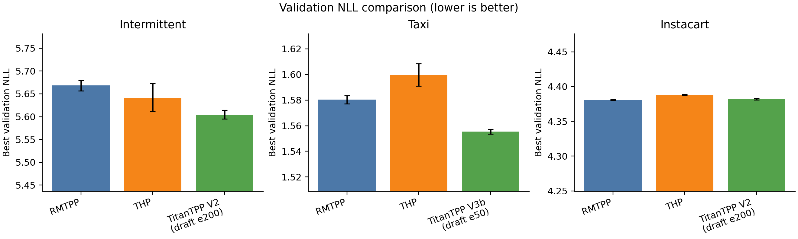
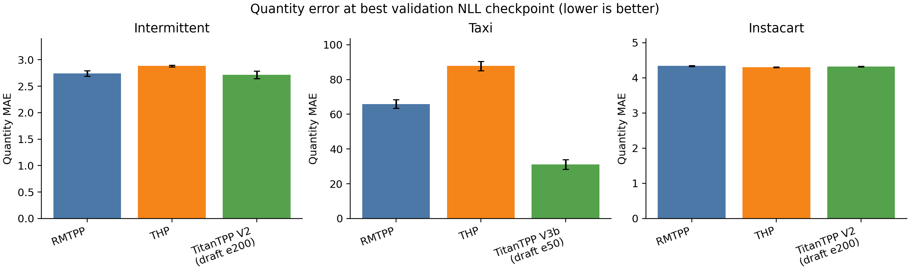

# TitanTPP: quantity-aware temporal point process modeling for intermittent demand

> Current final working draft: v0.2 four-page structure  
> Date: 2026-08-08 KST  
> Target: ICTC AICA 2026 short-paper draft  
> Versioned source: `paper/titantpp_short_paper_draft_v0_2_four_page.md`  
> Structure source: `paper/notion_exports/drafting_revision_final/04_four_page_structure_revision.md`  
> Status: validation-only working draft. Held-out test results are not evaluated or reported.

## 1. Introduction

Many demand forecasting problems contain long intervals with no observed demand, followed by irregular positive-demand events. A regular time-series formulation often represents this pattern through many zero-valued observations, but the resulting sequence can obscure two different questions: when demand will occur and how large the next positive demand will be. An event-based formulation makes this structure explicit. Each positive-demand observation is treated as an event with an occurrence time and a quantity, so the model predicts both the next inter-event time and the associated demand size. This setting is difficult because event histories may be long, event times are irregular, demand can be sparse or intermittent, and nonzero quantities are continuous rather than categorical.

Neural temporal point processes provide a useful starting point because they model event times and marks conditional on previous events. RMTPP, for example, embeds event history into a recurrent hidden state and predicts the next event time and mark from that state [1]. In demand-event sequences, however, this interface exposes three limitations. First, a fixed-dimensional recurrent state may compress long histories in a way that weakens access to older demand patterns and recent shifts. Second, the categorical mark formulation is more natural for event types than for continuous demand quantities. Third, a simple quantity regression head can compete with time and mark likelihood objectives when all heads update the same representation. TitanTPP addresses these limitations by combining a Titan-style long-history encoder with transformed quantity modeling, a quantity reconstruction path, and quantity-specific gradient separation where the data require it.

This study evaluates TitanTPP on three demand-event datasets with different sequence and quantity characteristics. Intermittent contains many part-level demand sequences, Taxi contains long grid-cell event histories with heavy-tailed pickup counts, and Instacart contains user-level basket sequences. We compare RMTPP-matched, THP-matched, and TitanTPP variants under fixed chronological splits, three random seeds, and validation-only model selection. The current RMTPP and THP e300 runs are final-ready validation baselines, while the existing TitanTPP rows remain preliminary because they were produced under earlier e50/e200 contracts. The draft therefore makes a bounded claim: TitanTPP appears promising for joint event-demand modeling, especially on Taxi quantity prediction, but final fair comparison requires fresh TitanTPP e300 runs under the same frozen contract.

## 2. Related work

Classical temporal point processes model event arrivals through conditional intensity functions, while neural temporal point processes replace hand-crafted history effects with learned representations. RMTPP is a representative recurrent marked temporal point process that embeds event history into a vector before predicting the next event time and mark [1]. Neural Hawkes Process extends this recurrent line with continuous-time LSTM dynamics [2]. These models motivate the event-history formulation adopted in this paper, but they also define the recurrent interface whose limitations become visible in long and quantity-bearing demand sequences.

Attention-based temporal point process models address history representation from a different direction. Self-Attentive Hawkes Process and Transformer Hawkes Process employ self-attention and temporal encodings to represent dependencies among prior events [3,4]. THP is therefore a useful comparison model because it replaces recurrence with attention while retaining a neural TPP objective. More recent memory architectures, including Titans, further motivate long-history modeling beyond fixed recurrent states and bounded attention contexts [5]. TitanTPP should be read as a TPP architecture influenced by this memory-oriented design space rather than as a direct reproduction of the original Titans model.

Demand quantity also differs from the categorical marks used in many marked TPP studies. Reviews of neural TPPs and factorial marked TPP models describe ways to represent event attributes beyond a single class label [6,7], and mixed-type event sequence models further support the distinction between categorical and continuous event attributes [8]. In intermittent-demand forecasting, Croston's method and deep renewal process models separate occurrence from positive demand size [9,10]. TitanTPP follows this broad separation, but it formulates the task as next-event prediction with explicit event time and reconstructed continuous quantity.

## 3. Method

### 3.1 Problem setup

For each demand series, a positive-demand event is denoted by $e_i=(t_i,q_i)$, where $t_i$ is the event time and $q_i>0$ is the observed demand quantity. The event history before the next prediction is

$$
\mathcal{H}_i=\{(t_j,q_j)\}_{j=1}^{i}.
$$

The inter-event time is $\Delta t_i=t_i-t_{i-1}$. Given $\mathcal{H}_i$, the model predicts the next inter-event time $\Delta t_{i+1}$ and the next quantity $q_{i+1}$. Zero-demand intervals are not inserted as explicit zero events; their duration is represented through $\Delta t$. This construction preserves the irregular waiting-time structure while keeping the target focused on positive-demand events.

Demand quantities can span several scales, so TitanTPP decomposes quantity into a coarse magnitude mark and a continuous residual. For a dataset-specific base $b$, the magnitude mark and residual are defined as

$$
m_i = \min(\lfloor \log_b q_i \rfloor, M),
$$

$$
r_i = \log_b q_i - m_i.
$$

The reconstructed quantity is

$$
q_i = b^{m_i+r_i}.
$$

This factorization lets the mark classifier model demand scale while the residual decoder preserves variation inside each scale. When the tail class is clipped at $M$, the residual can exceed the unit interval, allowing large quantities to remain reconstructable.

### 3.2 Limitations of RMTPP-style modeling

RMTPP-style modeling compresses event history into a recurrent state. This representation is compact and effective for many marked event sequences, but long demand histories can contain both older seasonal patterns and recent local changes. A single recurrent state may not preserve both forms of information with equal fidelity. The limitation is architectural rather than absolute, so this paper treats it as an empirical motivation and evaluates it on datasets with different sequence-length distributions.

The mark interface introduces a second mismatch. In many TPP applications, a mark denotes a finite event type. In demand prediction, however, the mark must describe a continuous and often skewed quantity. A purely categorical mark discards within-class variation, while direct raw regression can be dominated by large tail events. The proposed mark-residual formulation separates these requirements by predicting coarse scale and continuous residual information together.

Joint learning creates a third concern. Time likelihood, magnitude classification, and quantity reconstruction optimize related but non-identical objectives. If the same representation receives all gradients without separation, quantity-error updates may alter the representation used for event-time and mark likelihood. TitanTPP therefore introduces a quantity-specific path when the dataset and architecture require it. The Taxi V3b variant, for example, combines mark-conditioned residual experts with detached quantity-to-mark gradients.

### 3.3 TitanTPP architecture

TitanTPP follows the same conditional event prediction interface as the matched baselines. Given an event history, an encoder produces a history representation $h_i$. The model then predicts the magnitude-mark distribution $p_{i,k}=P(m_{i+1}=k \mid \mathcal{H}_i)$, the inter-event-time distribution, and a residual quantity estimate. The expected quantity prediction is reconstructed as

$$
\widehat{q}_{i+1}=\sum_{k=0}^{M} p_{i,k} b^{k+\widehat{r}_{i,k}}.
$$

The training objective combines mark, time, residual, and quantity losses:

$$
\mathcal{L}=\mathcal{L}_{\mathrm{mark}}+\lambda_t\mathcal{L}_{\mathrm{time}}+\lambda_r\mathcal{L}_{\mathrm{res}}+\lambda_q\mathcal{L}_{\mathrm{qty}}.
$$

The compared models differ mainly in the history encoder under the matched contract. RMTPP-matched employs a GRU encoder, THP-matched employs a Transformer encoder, and TitanTPP employs a Titan-style causal memory-attention encoder with persistent memory. Intermittent and Instacart currently use TitanTPP V2, which adopts a shared residual head and coupled gradient flow. Taxi uses TitanTPP V3b as the current primary model because its quantity distribution benefits from mark-conditioned residual experts and gradient separation. Validation and test do not update memory, and state is not transferred across unrelated demand series.

Figure 1 should describe the proposed model flow: event history enters the TitanTPP encoder, the encoder state feeds time and magnitude-mark heads, and the quantity path reconstructs demand through the mark-residual decoder. Figure 2 should visualize the quantity decomposition, including raw quantity, transformed magnitude mark, residual, and inverse reconstruction.

## 4. Experiments

### 4.1 Setup

The evaluation uses Intermittent, Taxi, and Instacart demand-event datasets. Intermittent contains 23,387 part-level sequences and 242,888 positive-demand events. Taxi contains 131 grid-cell sequences and 55,119 pickup events, with a median sequence length of 405 and a p95 length of 743. Instacart contains 206,209 user sequences and 3,279,521 order events. These datasets differ in sequence length and quantity scale, which allows the experiment to separate recurrent-history, attention-history, and quantity-modeling effects.

| Dataset | Sequences | Events | Seq. length med/p95/max | Quantity med/p95/max | Marks | Base |
|---|---:|---:|---:|---:|---:|---:|
| Intermittent | 23,387 | 242,888 | 6 / 35 / 110 | 2 / 16 / 5,000 | 11 | 2 |
| Taxi | 131 | 55,119 | 405 / 743 / 744 | 7 / 1,547 / 6,489 | 4 | 10 |
| Instacart | 206,209 | 3,279,521 | 10 / 50 / 100 | 8 / 25 / 177 | 8 | 2 |

RMTPP-matched and THP-matched are adapted baselines. They retain the encoder family of each original model, but they share the paper's residual quantity input, hybrid objective, output interface, fixed split, and checkpoint rule. This naming avoids presenting the runs as exact reproductions of the original RMTPP or THP papers. All frozen e300 baseline runs use seeds 42, 52, and 62, AdamW with learning rate 0.001, batch size 128, strict reproducibility mode, and minimum validation total NLL as the checkpoint rule. Held-out test evaluation remains locked until the validation-selected model identity and checkpoint policy are fixed.

### 4.2 Results

Table 2 reports the current validation-only comparison. Lower values are better for validation NLL, quantity MAE, and $\Delta t$ MAE; higher values are better for mark accuracy. TitanTPP rows are preliminary because their epoch budgets and artifact contracts differ from the frozen e300 baseline contract.

| Dataset | Model | Budget | Val NLL | Qty MAE | Delta-t MAE | Mark acc |
|---|---|---:|---:|---:|---:|---:|
| Intermittent | RMTPP-matched | e300 | 5.6683 +/- 0.0115 | 2.7408 +/- 0.0493 | 41.8872 +/- 0.5030 | 55.183% +/- 0.236%p |
| Intermittent | THP-matched | e300 | 5.6417 +/- 0.0305 | 2.8812 +/- 0.0177 | 40.5947 +/- 0.3284 | 54.235% +/- 0.637%p |
| Intermittent | TitanTPP V2 | e200 draft | 5.6046 +/- 0.0097 | 2.7162 +/- 0.0720 | 41.1990 +/- 0.4479 | 54.697% +/- 0.577%p |
| Taxi | RMTPP-matched | e300 | 1.5803 +/- 0.0032 | 65.8580 +/- 2.4748 | 0.7326 +/- 0.0085 | 91.800% +/- 0.117%p |
| Taxi | THP-matched | e300 | 1.5998 +/- 0.0087 | 87.7508 +/- 2.6771 | 0.7528 +/- 0.0224 | 91.461% +/- 0.202%p |
| Taxi | TitanTPP V3b | e50 draft | 1.5555 +/- 0.0019 | 31.0775 +/- 2.8184 | 0.7591 +/- 0.0206 | 92.267% +/- 0.194%p |
| Instacart | RMTPP-matched | e300 | 4.3809 +/- 0.0007 | 4.3379 +/- 0.0131 | 5.6690 +/- 0.0094 | 49.940% +/- 0.034%p |
| Instacart | THP-matched | e300 | 4.3881 +/- 0.0009 | 4.3046 +/- 0.0081 | 5.7063 +/- 0.0059 | 49.793% +/- 0.091%p |
| Instacart | TitanTPP V2 | e200 draft | 4.3819 +/- 0.0009 | 4.3199 +/- 0.0084 | 5.6768 +/- 0.0129 | 49.941% +/- 0.027%p |

On Intermittent, TitanTPP V2 reports lower validation NLL than RMTPP-matched and THP-matched. Quantity MAE improves over THP but only modestly over RMTPP. This pattern supports the event-likelihood direction more strongly than a broad quantity claim.

Taxi provides the strongest preliminary result. TitanTPP V3b reduces quantity MAE by 52.8% relative to RMTPP-matched and by 64.6% relative to THP-matched. It also reports lower validation NLL and higher mark accuracy than both baselines. Its $\Delta t$ MAE is slightly worse than RMTPP, so the result should be interpreted as a quantity and mark improvement with a small time-error trade-off.

Instacart remains mixed. TitanTPP V2 is close to RMTPP-matched in validation NLL and lies between RMTPP and THP in quantity MAE. The current evidence does not support a strong Instacart claim.

### 4.3 Ablation and analysis

The final ablation should remain narrow because the manuscript is limited to four pages. The first analysis compares RMTPP-original and RMTPP-matched to estimate the effect of the quantity interface, although this comparison changes several components and should be interpreted cautiously. The second analysis compares RMTPP-matched, THP-matched, and TitanTPP V2 under the same quantity contract to separate encoder effects. The third analysis focuses on Taxi V2 and V3b, where mark-conditioned residual experts and detached quantity-to-mark gradients form the final draft architecture. If time permits, a 2x2 ablation should separate expert heads from gradient detachment; otherwise, V3b should be described as a combined design.

## 5. Conclusion

This paper formulates intermittent demand forecasting as a marked temporal point process with continuous quantity reconstruction. The formulation exposes two limitations of common neural TPP interfaces: recurrent history compression can be restrictive for long event histories, and categorical marks alone cannot reconstruct within-class demand variation. TitanTPP addresses these limitations through a Titan-style history encoder, a log-magnitude mark, a continuous residual, and a differentiable quantity decoder.

The current validation evidence supports a cautious interpretation. RMTPP-matched and THP-matched are available as final-ready e300 validation baselines, while existing TitanTPP artifacts provide preliminary support on Intermittent and Taxi. The next experimental step is fixed: run TitanTPP V3b on Taxi and TitanTPP V2 on Intermittent and Instacart under the same frozen e300 contract, regenerate the validation table and figures, and evaluate the held-out test only after the model and checkpoint policy are frozen.

## References

[1] N. Du, H. Dai, R. Trivedi, U. Upadhyay, M. R. Gomez-Rodriguez, and L. Song, "Recurrent Marked Temporal Point Processes: Embedding Event History to Vector," KDD, 2016.

[2] H. Mei and J. Eisner, "The Neural Hawkes Process: A Neurally Self-Modulating Multivariate Point Process," NeurIPS, 2017.

[3] Q. Zhang, A. Lipani, O. Kirnap, and E. Yilmaz, "Self-Attentive Hawkes Process," ICML, 2020.

[4] S. Zuo, H. Jiang, Z. Li, T. Zhao, and H. Zha, "Transformer Hawkes Process," ICML, 2020.

[5] A. Behrouz, P. Zhong, and V. Mirrokni, "Titans: Learning to Memorize at Test Time," NeurIPS, 2025.

[6] O. Shchur, A. C. Türkmen, T. Januschowski, and S. Günnemann, "Neural Temporal Point Processes: A Review," IJCAI, 2021.

[7] Y. Wu, N. Li, R. B. Silva, and A. Smola, "Decoupled Learning for Factorial Marked Temporal Point Processes," KDD, 2018.

[8] F. Draxler, A. G. Baydin, and F. Wood, "Transformers for Mixed-type Event Sequences," NeurIPS, 2025.

[9] J. D. Croston, "Forecasting and Stock Control for Intermittent Demands," Operational Research Quarterly, 1972.

[10] A. C. Türkmen, Y. Wang, and T. Januschowski, "Forecasting intermittent and sparse time series: A unified probabilistic framework via deep renewal processes," PLOS ONE, 2021.
