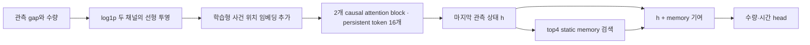

**결론 — encoder 전달 경로 확인 완료, 상대시간 후보는 근거 부족으로 보류**

현재 Hard-LMM은 사건 순서·간격·수량 이력을 실제 예측에 반영합니다. 실제 경과시간을 attention에 명시하는 구조는 없지만, 시간 입력을 무시하거나 수량 변화가 전달되지 않는다고 볼 근거도 없습니다.

검토할 가설은 **“다른 관측 조건이 비슷해도, 사건 순서상 거리와 실제 경과시간의 배치가 많이 다른 이력에서 body 수량 오차가 커지는가”** 하나로 좁혔습니다. 이번 사전 기준을 충족하지 못했으므로 구현할 architecture 후보로 선정하지 않습니다. **관계가 없다고 입증한 결과도 아닙니다.**

Instacart에서 기술적으로 관찰된 separate-key body MAE 차이는 **+4.489%**였으나, 사전 관련성 기준 5%보다 작고 두 비교 구간 모두 이력 길이의 균형 조건을 충족하지 못했습니다. Taxi는 공통 비교 구간의 표본 지원 조건을 만족하지 못했습니다. 결과에 맞춰 조건을 바꾸거나 다른 특징을 추가 탐색하지 않았습니다.

**현재 기준선 — 완료 / paper_research, 로컬 CPU**

- 소스 기준선 `master`, `69ea814`. 원본 TitanTPP-HardLMM 공식 기준선을 유지하고 separate-key checkpoint를 병행 관찰했습니다.
- Dataset당 기존과 동일한 train target **8,192개**, 두 모델의 같은 target·series·context·fold를 사용했습니다. 원본 이력·수량 label·기존 통계가 이전 cache와 일치합니다.
- Train만 필터링한 뒤 parquet를 읽었습니다. Target 수량은 body 구분과 오류 계산에만 사용했으며, target gap·target 수량·padding을 관측 특징과 변형 이력에서 제외했습니다. Validation·held-out은 사용하지 않았습니다.
- 모델 fitting·파라미터 업데이트·새 architecture 구현·5090 실행은 수행하지 않았습니다. 고정 checkpoint의 작은 로컬 재생으로 충분했습니다.

**사건 순서·경과시간·수량이 전달되는 실제 경로**

| 확인 대상 | 현재 처리와 의미 |
|---|---|
| 관측 범위 | `seq` 기준 lookback 구간에 target을 붙이고 최대 길이를 적용합니다. Taxi 단위는 시간, Instacart는 일입니다. 이름 `lookback_weeks`만 보고 주 단위로 해석하면 안 됩니다. |
| 사건 순서 | 각 window에서 0부터 시작하는 학습형 절대 사건 위치를 더합니다. 같은 suffix라도 앞에 남은 관측 수가 달라지면 위치 index가 달라집니다. |
| 경과시간 | 각 사건의 `log1p(delta_t)`가 입력됩니다. 누적 age·실제 상대시간 bias·달력 위상은 별도 입력되지 않습니다. 기존 attention이 여러 gap의 관계를 학습할 가능성까지 배제하지 않습니다. |
| 수량 변화 | 각 사건의 `log1p(quantity)`가 입력됩니다. 수량 차분을 별도 채널로 주지는 않지만, 전체 관측 수량열을 통해 변화 순서를 학습할 수 있습니다. |
| 이력 요약 | 마지막 관측의 causal state를 읽습니다. 이 관측은 현재 window 안의 앞선 사건과 persistent token을 볼 수 있으며 window 간 contextual state update는 꺼져 있습니다. |
| 정규화 | LayerNorm은 token의 hidden 차원에 적용되고 residual 경로가 남습니다. RevIN이 없으므로 “정규화가 지운 수량 수준을 복구한다”는 설명은 적용되지 않습니다. |
| 첫 retained gap | Window 밖 직전 사건과의 간격일 수 있으며 loader는 값을 보존합니다. 이번 내부 age는 첫 gap을 제외한 `sum(dt[i+1:H])`로 계산했습니다. |

코드 근거: [dataset](/Users/igwanhyeong/PycharmProjects/paper_research/data_loader/event_seq_data_module.py:337), [padding·예측 위치](/Users/igwanhyeong/PycharmProjects/paper_research/paper/scripts/count_aware_tpp_backbone/core.py:41), [입력 변환](/Users/igwanhyeong/PycharmProjects/paper_research/models/TPPs/CountAwareTPP.py:299), [encoder 구성](/Users/igwanhyeong/PycharmProjects/paper_research/models/TPPs/CountAwareTPP.py:754), [위치 임베딩](/Users/igwanhyeong/PycharmProjects/paper_research/models/Titan/backbone.py:211), [attention](/Users/igwanhyeong/PycharmProjects/paper_research/models/Titan/common/memory.py:152).

**새로 비교한 대상 — 현재 active context의 시간 배치**

관측 사건이 H개일 때 실제 age를 내부 관측 span으로 나눈 값과 사건 index만으로 계산한 상대 age `(H-1-i)/(H-1)` 사이의 RMS 차이를 **J**로 정의했습니다. 등간격이면 J=0입니다. 내부 gap을 모두 같은 배율로 늘리면 J는 변하지 않으므로 절대 시간 규모의 모든 정보를 측정하는 지표는 아닙니다. H<3은 미정의로 집계하고 규칙적인 이력으로 취급하지 않았습니다.

| 시간 배치의 관찰 범위 | Taxi | Instacart |
|---|---:|---:|
| J를 계산할 수 있는 이력 | 8,139 / 8,192 | 6,390 / 8,192 |
| 해당 이력 중 등간격 비중 | 43.752% | 1.049% |
| J 중앙값 | 0.005649 | 0.076110 |
| J 95백분위 | 0.098511 | 0.196493 |
| 관측 수 중앙값 / 최댓값 | 128 / 168 | 5 / 37 |
| `max_seq_len` 때문에 추가로 잘린 표본 | 0 | 0 |

두 dataset 모두 J에 변동이 있습니다. 시간 정보를 비교할 여지가 전혀 없었던 것은 아닙니다. 최대 token 길이가 현재 표본의 이력을 추가로 자르는 원인이었다는 근거도 없습니다. 이는 시간 lookback 밖의 사건까지 모두 관측한다는 뜻은 아닙니다.

**실제 오류와의 관계 — 비교 가능성 조건부터 실패**

각 train fold에서 반대 fold의 **입력만으로** J의 하위·상위 25%와 통제 구간을 정했습니다. Body는 기존 전체 train p95인 Taxi **1,562**, Instacart **25** 이하 target입니다. 수량 수준 3구간 × 이력 길이 2구간 × 수량 변화량 2구간 × 절대 평균 gap 2구간에서 양쪽 표본이 충분한 구간만 사용했습니다.

각 구간에서 작은 집단의 표본 수를 두 집단의 공통 가중치로 사용했습니다. 각 집단 최소 20개 표본·5개 series, fold 전체 각 집단 최소 100개 표본·20개 series, 극단 집단의 50% 이상 보존, 통제 변수의 표준화 평균 차이 절댓값 **0.25 이하**를 요구했습니다. 같은 행과 가중치로 두 checkpoint를 평가했습니다.

| Instacart separate-key | J 낮음 body MAE | J 높음 body MAE | 높은 집단의 초과 오차 | 이력 길이 균형 차이 |
|---|---:|---:|---:|---:|
| Fold 0 | 3.040466 | 3.265747 | +7.409% | −0.3255 — 기준 초과 |
| Fold 1 | 3.423911 | 3.491035 | +1.960% | −0.2562 — 기준 초과 |
| 합산 기술통계 | 3.234624 | 3.379822 | **+4.489%** | 두 fold 모두 불충족 |

Fold 0에는 낮음/높음 **438/453개**, fold 1에는 **493/480개**가 남았습니다. 유지 비율은 각각 **58.54% / 63.35%**였지만, 높은 J 집단의 이력이 더 짧았습니다. 가중 평균 관측 수는 fold 0에서 **8.52 → 7.00**, fold 1에서 **7.27 → 6.09**였습니다. 따라서 오차 차이를 시간 배치와 분리해 해석할 수 없습니다.

합산 차이 **4.489%** 역시 사전 관련성 기준 5%보다 작습니다. 원본의 같은 기술통계는 **+4.314%**였습니다. 원본과 separate-key가 같은 방향이라는 것만으로 위 조건 실패를 대체하지 않습니다. Bootstrap은 비교 가능성 조건 통과 후에만 수행하도록 정했으므로 이번에는 실행하지 않았습니다.

Taxi는 양쪽 집단의 표본·series 수를 만족하는 통제 구간이 **0개**였습니다. J가 다른 집단 사이의 다른 관측 조건도 달라 공통 비교가 성립하지 않은 결과이며, 시간 표현의 효과가 0이라는 결과가 아닙니다.

**고정 encoder의 반응 — 시간과 수량 순서는 실제로 전달됨**

Dataset당 H>=4인 기존 train 표본에서 **512개**를 입력 기준·고정 seed로 골랐습니다. 첫 사건과 마지막 사건을 고정하고 내부 수량 순서 또는 내부 gap 순서만 뒤집었습니다. 관측 수, 각 값의 multiset, 내부 span, 평균 log 수량과 최근 편차는 보존됩니다. 수량 변화량이나 gap–수량의 결합 관계까지 보존되는 것은 아닙니다.

| Separate-key에서 실제 변형된 이력 | 변경 수 / 512 | local state 상대 L2 변화 평균 | log1p 수량 예측 절대 변화 평균 | top4 집합 유지 비율 |
|---|---:|---:|---:|---:|
| Taxi · gap 순서 | 286 | 0.048288 | 0.024252 | 96.154% |
| Taxi · 수량 순서 | 507 | 0.108416 | 0.135200 | 84.615% |
| Instacart · gap 순서 | 499 | 0.063735 | 0.011958 | 98.597% |
| Instacart · 수량 순서 | 487 | 0.058076 | 0.045065 | 98.563% |

두 checkpoint 모두 변형 전의 `h`와 수량 logit이 기존 cache와 **오차 0**으로 일치했습니다. 내부 순서를 바꿨을 때 상태와 예측이 변했으므로, 간격·수량 순서가 입력되어도 전혀 읽히지 않는다는 설명은 맞지 않습니다. 반응 크기가 다르다는 것만으로 시간과 수량의 중요도 순위를 정하거나 현재 표현이 충분하다고 결론 내리지도 않습니다. 합성 이력에는 대응하는 실제 target이 없으므로 **변형 이력의 MAE·NLL은 계산하지 않았습니다.**

**기존 실험과의 중복 제외**

- 두 수량 통계 query와 value·결합 방식은 앞선 진단의 보류 판정을 유지합니다.
- [Frozen readout factorial](../hard_lmm_readout_factorial_20260903/README.md)은 official joint selector에서 0/24 통과였으므로 단순 readout 용량 확대로 되돌아가지 않습니다.
- [Hard-LMM local-time routing](../hard_lmm_local_time_screening_20260904/README.md)은 Taxi·RAF 0/2 기준 미충족으로 완료됐습니다. 이번 attention의 시간 관계와 다른 변경입니다.
- [Legacy V6/V7 pre-window audit](/Users/igwanhyeong/PycharmProjects/paper_research/simple_lab_test/search/model_enhancement_strategy.md:2015)는 이미 종료됐습니다. 이번 가설은 현재 허용된 context 안의 관계이며, window 밖 temporal summary를 다시 추가하는 가설이 아닙니다.
- 현재 `log1p(gap)`·`log1p(quantity)` 입력을 새 정보인 것처럼 추가하거나, time-head 분포·tail loss·RevIN 변경을 encoder 증거 없이 다시 제안하지 않습니다.

**검증과 증적 — 완료**

- 시간 특징·변형 불변량·조건부 비교·입력만을 이용한 경계 산정·target/padding 제외 테스트 **31개 통과** (`local_pytest.xml`).
- 실행 전후 기존 입력·소스 및 새 코드 **173개 SHA-256** 일치. 원본 이력 특징과 이전 cache가 일치하고, checkpoint 상태가 재생 전후 동일합니다.
- 별도 NumPy 감사에서 **183개 hash와 4개 checkpoint 상태**를 검증하고, train parquet에서 **16,384개 이력 전체**를 독립 재구성했습니다. 특징의 최대 차이는 **3.55e-15**, 경계·집단·가중치는 완전 일치, MAE·균형 통계의 최대 차이는 **8.88e-16**이었습니다. 저장된 민감도 출력도 재검산했습니다.
- 분석은 `analysis.json`, 계약은 `paper/contracts/hard_lmm_temporal_diagnostic_v1.json`, 독립 검증은 `independent_audit.json`에 기록했습니다.
- 행별 특징·비교 집단·가중치·민감도 출력은 `search_artifacts/hard_lmm_temporal_diagnostic_20260905`에 저장하고 hash를 manifest에 고정했습니다. 이 원시 산출물은 Git에 포함하지 않습니다.
- 재현: `python3 paper/scripts/run_hard_lmm_temporal_diagnostic.py`. 기존 결과와 원시 디렉터리를 덮어쓰지 않도록 재실행 시 중단합니다.

두 fold는 서로 다른 series이지만 backbone은 이 train 자료로 학습됐고 validation으로 checkpoint가 선택됐습니다. 따라서 이 비교나 민감도 검사는 독립적인 일반화 검증이 아닙니다.

**남은 작업 순서**

1. **다음 작업 — 같은 가설의 독립적인 비교 설계 검토 / paper_research, Instacart, 로컬.** 후속 확인을 선택한다면 이번 진단에 사용하지 않은 train series를 대상으로, 새 오류를 보기 전에 이력 길이와 나머지 관측 조건의 균형·공통 비교 표본을 확보하는 계약부터 정합니다. Instacart는 전체 train 206,209개 중 이번에 7,848개 series를 사용했고, 198,361개가 이번 표본 밖에 있습니다. Taxi는 전체 131개 series가 이미 포함돼 같은 방식의 새 series 비교가 불가능합니다. J 정의·5% 관련성 기준·균형 기준·고정 실행 범위를 유지하고, 지원 조건을 만들 수 없으면 종료합니다. 현재 표본의 조건을 수정해 다시 통과시키는 재실행은 하지 않습니다.
2. **조건부 다음 작업 — 상대시간 후보 계약 구체화 / paper_research, 로컬.** 위 가설의 근거가 확보될 때만 기존 active context 안의 상대 elapsed-age 관계를 attention에 명시하는 단일 후보를 정의합니다. 현재는 새 시간 bias 구현·재학습·5090 작업으로 이어가지 않습니다.

위 순서는 현재 결론에 의존하므로 직렬입니다. 이번에 확정한 것은 코드 경로와 진단의 한계이며, 채택할 architecture나 encoder 결함이 아닙니다.
