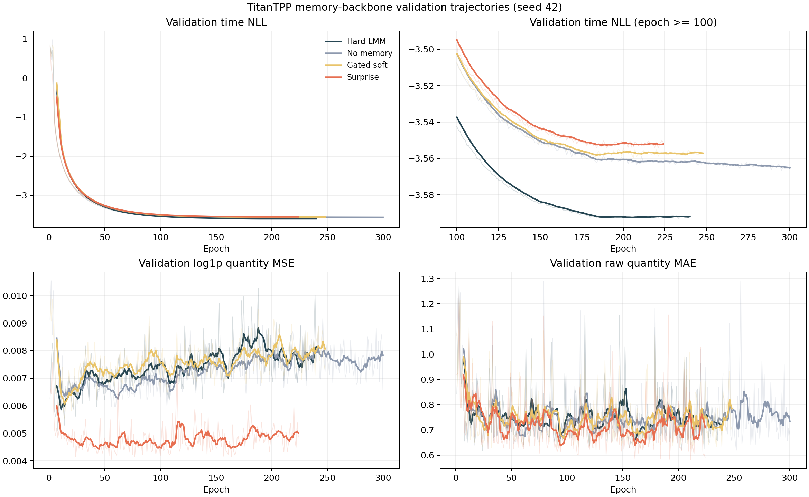
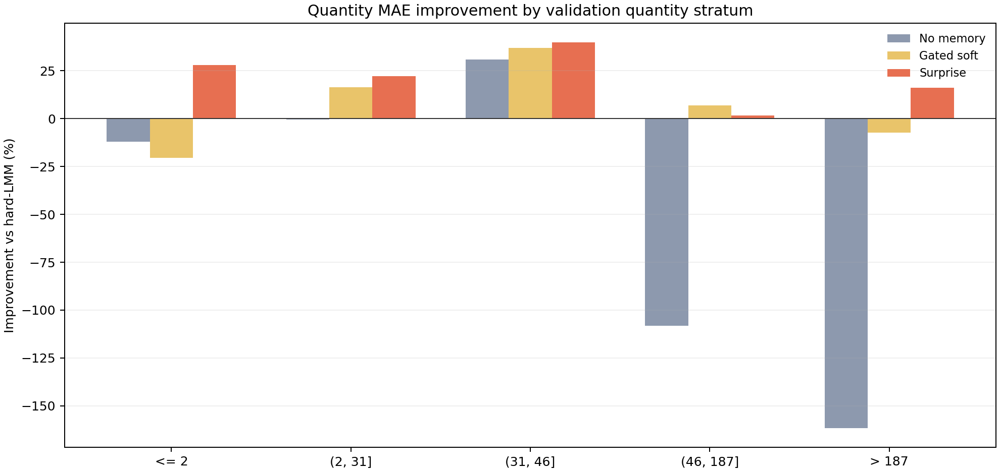
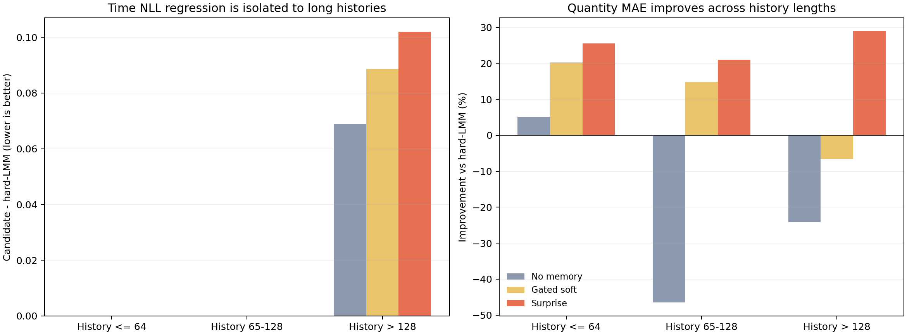

# TitanTPP Memory Backbone Intermittent Seed-42 결과

## 최종 판정

이번 실험의 사전 정의 기준으로는 신규 memory 후보가 통과하지 못했으므로
`titantpp` hard-LMM을 유지한다. 다만 수량 예측만 분리해서 보면
`titantpp_surprise_memory`가 가장 유력하다. Hard-LMM 대비 validation quantity MAE를
23.24%, RMSE를 11.35%, log1p quantity MSE를 38.14% 개선했다.

현재 Time NLL 악화를 이유로 Surprise memory를 종료해서는 안 된다. 분석 결과 Time
NLL 차이의 99.98%가 128개 초과 장기 이력 표본에 집중됐고, 공통 time head 자체도
모든 validation target에서 수치 clamp가 활성화됐다. 따라서 이번 결과는
"Surprise memory가 수량 표현은 개선했지만 현재 time 경로와 충돌했다"는 진단
결과이며, 확률적 time 성능의 최종 비교 결과는 아니다.

## Artifact 검증

분석은 `manifest -> log -> summary -> histories -> scale-wise metrics -> plots` 순서로
진행했다.

| 확인 항목 | 결과 |
| --- | --- |
| Source revision | `c65c0da68d49150d5d25b8ef4665cb64b065503c` |
| Source checksum | 12개 파일 모두 일치 |
| Dataset checksum | 고정 Intermittent parquet 및 split manifest와 일치 |
| 실행 결과 | 4/4 success, NaN/Inf/Traceback 없음 |
| 비교 조건 | seed 42, 최대 300 epoch, batch 128, LR 1e-3, max seq 256 |
| Checkpoint | validation joint objective 최저 지점 |
| 평가 범위 | validation only |
| Held-out test | 미사용, test artifact 없음 |

## 전체 결과

| Backbone | Best / 완료 epoch | Joint objective | Time NLL | Log quantity MSE | Quantity MAE | Quantity RMSE |
| --- | ---: | ---: | ---: | ---: | ---: | ---: |
| Hard-LMM | 200 / 240 | -3.585706 | -3.592856 | 0.007150 | 0.762085 | 1.722403 |
| No memory | 295 / 300 | -3.559329 | -3.566662 | 0.007333 | 0.960356 | 2.833570 |
| Gated soft | 208 / 248 | -3.551914 | -3.559257 | 0.007343 | 0.645469 | 1.619822 |
| Surprise | 184 / 224 | -3.549746 | -3.554169 | **0.004424** | **0.584995** | **1.526960** |

No-memory는 수량과 time 모두 악화됐다. 단순히 memory를 제거하는 방향은 적절하지
않다. Gated-soft는 수량 MAE와 RMSE를 개선했지만 log quantity MSE와 Time NLL은
악화됐다. Surprise memory는 수량 지표 세 가지를 모두 가장 크게 개선했지만 Time
NLL이 0.038687 높아져 기존 gate를 통과하지 못했다.

## Quantity 개선 분석

Surprise memory의 개선은 특정 이력 길이에만 의존하지 않았다.

| Validation history | 표본 비율 | MAE 개선 | RMSE 개선 | Log MSE 개선 |
| --- | ---: | ---: | ---: | ---: |
| 64 이하 | 29.08% | 25.52% | 18.64% | 40.08% |
| 65-128 | 32.98% | 21.04% | 8.79% | 37.97% |
| 128 초과 | 37.95% | 28.94% | 15.80% | 37.48% |

수량 크기별 MAE도 모든 구간에서 개선됐다. `quantity <= 2`는 28.01%, `(2, 31]`은
22.17%, `(31, 46]`은 39.90%, `(46, 187]`은 1.71%, `>187`은 16.11% 개선됐다.
중간 tail인 p95-p99의 개선 폭은 작지만, 전체 개선이 저수량 또는 극단 tail 하나의
효과만으로 만들어진 것은 아니다.

학습 궤적에서도 Surprise의 후반 40 epoch log MSE 중앙값은 0.004929로 Hard-LMM의
0.007658보다 낮았다. 반면 raw MAE와 RMSE는 인접 epoch 사이 변동이 커서, 현재
headline 수치는 seed-42 선택 checkpoint에 대한 결과로 한정해야 한다.





## Time NLL 저하 분석

### 장기 이력에 집중된 차이

Surprise와 Hard-LMM의 전체 Time NLL 차이는 0.038687이다. 이를 이력 길이별로
분해하면 128개 초과 구간의 가중 기여도가 0.038679로, 전체 차이의 99.98%를
설명한다.

| Validation history | Hard-LMM | Surprise | 차이 |
| --- | ---: | ---: | ---: |
| 64 이하 | -3.599458 | -3.599454 | +0.000004 |
| 65-128 | -3.599425 | -3.599407 | +0.000019 |
| 128 초과 | -3.582088 | -3.480153 | **+0.101935** |

장기 이력 표본은 동시에 event 간격이 짧은 고빈도 series다. 이 구간 target의 74.18%가
`delta_t = 1`이고 중앙값은 1이다. 반면 64 이하 구간의 target 중앙값은 5다. 즉 현재
차이는 일반적인 time 예측 저하라기보다, 고빈도 장기 이력을 표현하는 경로가
Hard-LMM 제거 후 달라진 현상에 가깝다.



### Checkpoint 선택 문제는 아님

Surprise가 전체 epoch에서 기록한 최저 Time NLL은 epoch 221의 -3.554224다. 이는
Hard-LMM 선택 checkpoint의 -3.592856보다 여전히 0.0386 이상 높다. 따라서 joint
objective checkpoint가 우연히 나쁜 time 지점을 선택해서 발생한 차이는 아니다.

### 현재 비교에서 분리되지 않은 구조 차이

Hard-LMM control은 `persistent token 16 + hard top-k LMM`을 함께 사용한다. 반면
No-memory, Gated-soft, Surprise는 persistent token을 0으로 바꾼 뒤 각 memory를
비교한다. 따라서 이번 실험은 아래 세 효과를 동시에 바꿨다.

1. Persistent token 제거
2. Hard-LMM 제거
3. Soft 또는 Surprise memory 추가

No-memory만으로도 128개 초과 구간 Time NLL이 0.068919 악화됐다. Gated-soft와
Surprise는 각각 0.088544, 0.101935 악화됐다. Hard-LMM의 장기 time 이점이
persistent token에서 오는지, hard retrieval에서 오는지 아직 분리되지 않았다.

### 공통 time head 수치 계약 문제

현재 time head는 RMTPP식 밀도에 아래 계산을 사용한다.

```text
w = softplus(w_raw) + 0.001
wd = min(w * delta_t, 10)
log f(delta_t) = a + wd - exp(a) / w * (exp(wd) - 1)
```

네 모델의 선택 checkpoint에서 `w`는 모두 약 99.43이다. Clamp가 시작되는
`delta_t`는 `10 / w = 0.1006`인데 validation target의 최소 `delta_t`는 1이다.
따라서 모든 validation target이 `wd=10`으로 잘린다.

이 clamp는 overflow를 막지만, threshold 이후 log density를 상수로 만든다. 결과적으로
계산된 함수는 시간축 전체에서 적분값이 1인 확률밀도가 아니다. 현재 Time NLL은 같은
코드를 사용한 모델 간 내부 점수로는 참고할 수 있지만, calibrated likelihood 또는
논문의 최종 NLL로 해석하면 안 된다. 이 문제는 Count-aware Titan뿐 아니라 동일 수식을
사용하는 RMTPP, THP 비교에도 공통으로 적용된다.

또한 clamp 이후에는 모든 target이 동일한 `wd=10`을 사용한다. 누적 hazard penalty의
분모에는 clamp되지 않은 `w`가 남아 있어, optimizer는 `w`를 계속 키우면 loss를 낮출 수
있다. 네 checkpoint의 `w`가 모두 약 99.43까지 증가한 이유도 이 경로와 일치한다.
따라서 현재 장기 이력 구간의 NLL 차이는 실제 target `delta_t`의 크기를 구별한 결과가
아니라, backbone이 만든 hidden-state time intercept 차이를 주로 반영한다. 장기 이력
집중 현상은 다음 구조를 찾는 단서지만 실제 time 예측 저하의 확정 증거는 아니다.

## 다음 구조 결정

### 1. Time head 수치 계약을 먼저 수정

Memory 후보를 추가로 학습하기 전에 공통 time head를 정상화한다.

- `delta_t`를 train split에서 고정한 scale로 나눠 학습하고, density 계산 시 Jacobian을
  포함해 원 단위 log likelihood로 복원한다.
- `w`는 train-only time 범위에서 overflow가 발생하지 않는 상한을 갖도록
  parameterize하고, `w * delta_t`를 일방적으로 자르는 현재 clamp를 제거한다.
- 누적 hazard와 `expm1`은 float64 경로에서 계산하고 finite 여부를 검사한다.
- 수치 적분한 density가 1에 가까운지, survival이 단조 감소하는지, gradient가 finite인지
  focused contract test로 검증한다.
- Time NLL과 함께 delta-time MAE, median absolute error, calibration을 기록한다.

첫 후보는 위 조건을 만족하는 **scaled exact RMTPP head**다. 이 방식이 실제 train
time 범위에서 안정화되지 않으면, 별도 ablation으로 positive scale을 갖는 log-normal
duration head를 사용한다. 수정 전후 NLL은 직접 이어 붙이지 않고, 모든 backbone을
fresh matched 조건으로 다시 비교한다.

Train-only target `delta_t`는 중앙값 3, p99 7, 최댓값 36이다. 따라서 초기 계약
후보는 `time_scale=3`으로 두고, train 최대 `w * scaled_delta_t`가 40을 넘지 않도록
`w_max=3.3333`을 두는 방식이다. 이 상수는 validation 결과를 보지 않고 train
split에서만 산출했다. 실제 구현 전 수치 적분 및 gradient test로 최종 확정한다.

### 2. Persistent token과 memory 효과를 분리

수정된 공통 time head 아래에서 다음 네 구조를 seed 42로 먼저 비교한다.

| 구조 | Persistent token | Hard-LMM | Surprise | 확인 목적 |
| --- | :---: | :---: | :---: | --- |
| M0 | 16 | 없음 | 없음 | persistent token 단독 기여 |
| M1 | 16 | 사용 | 없음 | 현재 hard-LMM control |
| M2 | 16 | 없음 | 사용 | persistent 조건을 맞춘 Surprise 효과 |
| M3 | 16 | time 경로에 사용 | quantity 경로에 사용 | task별 memory 분리 |

현재 결과만으로는 M3가 가장 타당한 다음 모델이다. 공통 Titan encoder와 persistent
token은 유지하되, time head는 Hard-LMM 상태를 받고 quantity head는 Surprise residual이
추가된 상태를 받는다.

```text
h_base = TitanEncoder_with_persistent_tokens(history)
h_time = HardLMM(h_base)
h_qty  = h_time + gate * SurpriseMemory(h_base)

time prediction     = TimeHead(h_time)
quantity prediction = QuantityHead(h_qty)
```

Quantity loss가 다시 time 경로를 훼손하는지 확인하기 위해 fully-shared와
Surprise-adapter-only gradient routing을 함께 둔다. Gate는 0에서 시작해 기존
Hard-LMM 동작을 초기 상태에서 보존한다.

## 후속 Acceptance 기준

1. Time head contract test를 모두 통과하고 validation clamp 비율이 0이어야 한다.
2. M2/M3는 matched M1 대비 quantity MAE 또는 RMSE를 5% 이상 개선해야 한다.
3. p95 이하 MAE 악화는 2% 이하여야 한다.
4. 수정된 정상화 NLL에서 Time NLL 악화는 0.01 이하여야 한다.
5. Seed-42 screening 통과 후에만 seeds 52, 62를 실행한다.
6. 최종 구조 확정 전까지 held-out test를 사용하지 않는다.

## 결론

Surprise memory는 TitanTPP의 수량 표현을 개선할 가능성을 명확히 보였다. 그러나 현
실험은 persistent token 조건이 맞지 않고 time head의 likelihood 계산도 포화되어 있어,
Time NLL 차이를 Surprise memory의 본질적 실패로 결론 내릴 수 없다. 다음 단계는
**공통 time head 정상화 -> persistent-matched memory 비교 -> dual-route M3 검증** 순서가
적절하다. 이 절차를 통과하기 전에는 Surprise memory를 최종 모델로 확정하지 않는다.

## 재현 명령어

```bash
python paper/scripts/analyze_titantpp_memory_backbone_result.py \
  --artifact-dir search_artifacts/count_aware_titan_memory_backbone_screening_e300_20260818 \
  --data sample_data/intermittent_v2/intermittent_frozen_5000_with_split.parquet \
  --output-dir paper/results/titantpp_memory_backbone_inter_seed42_e300_20260818/analysis
```
