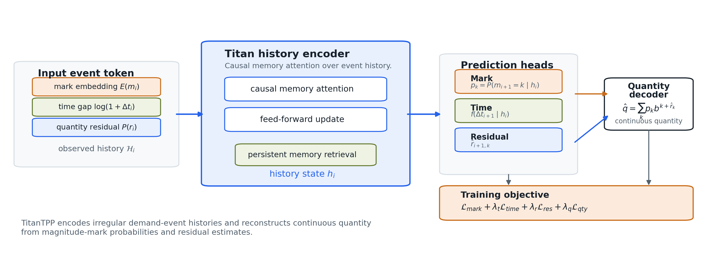
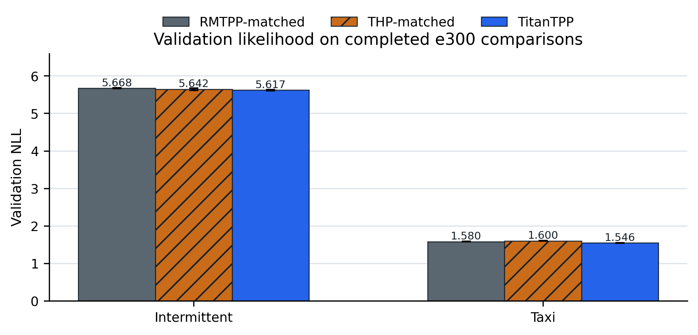
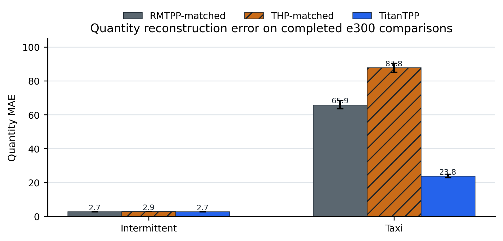

# TitanTPP: quantity-aware temporal point process modeling for intermittent demand

> Manuscript version: v0.4  
> Date: 2026-08-10 KST  
> Target: ICTC AICA 2026 short-paper manuscript  
> Structure source: `paper/notion_exports/drafting_revision_final/04_four_page_structure_revision.md`  
> Evaluation policy: validation-based model selection with held-out test evaluation reserved for the selected final model.

## 1. Introduction

Demand for slow-moving items, spare parts, and long-tail retail products is intermittent: long stretches with no orders are punctuated by irregularly timed events of varying size. Standard time-series forecasting represents such data as many zero-valued observations, but this representation can hide the event structure of the problem. In practice, the forecasting task asks two coupled questions. The model must estimate when the next positive-demand event will occur and how large that demand will be. An event-based formulation makes this structure explicit by treating each positive-demand observation as an event with an occurrence time and a quantity.

Classical temporal point processes model event arrivals through a conditional intensity function, but their behavior often depends on how the history effect is specified [10,12]. Kernel-based or parametric intensity forms can represent simple excitation and decay patterns, yet they are less suited to complex event trajectories with nonlinear temporal dependencies [1,10]. Deep neural TPPs address this limitation by learning history representations from event sequences, allowing the model to encode irregular temporal and mark dependencies directly from data [1,6]. RMTPP is an early and influential neural TPP in this line of work: it summarizes previous events with a recurrent hidden state and predicts the next event time and categorical mark from that representation [1]. For demand-event forecasting, however, the RMTPP interface raises three challenges. First, a fixed-dimensional recurrent state can compress long histories in a way that weakens access to older demand patterns and recent local shifts. Second, categorical marks are well suited to event types, but they do not directly reconstruct continuous and heavy-tailed demand quantities. Third, rare large-demand events can dominate a direct regression objective, and the resulting gradient scale can interfere with time and mark likelihood learning when all heads update the same representation.

This paper proposes TitanTPP, a quantity-aware temporal point process for intermittent demand events. TitanTPP combines a Titan-style long-history encoder with a transformed quantity representation in which a coarse log-magnitude mark and a continuous residual reconstruct the original demand quantity. For datasets where quantity reconstruction and event likelihood interact strongly, the model further separates selected quantity gradients from the mark path. These design choices target the three difficulties above: long-history representation, continuous quantity modeling, and rare-event gradient interference. The study evaluates TitanTPP on Intermittent, Taxi, and Instacart demand-event datasets under fixed chronological splits, three random seeds, and the same validation checkpoint rule.

## 2. Related work

Classical temporal point processes model event arrivals through conditional intensity functions, including self-exciting processes in which past events influence future arrivals [10,12]. Neural temporal point processes replace these hand-crafted history effects with learned representations. RMTPP is a representative recurrent marked temporal point process that embeds event history into a vector before predicting the next event time and mark [1]. Neural Hawkes Process extends this recurrent line with continuous-time LSTM dynamics [2]. These models motivate the event-history formulation adopted in this paper, but they also define the recurrent interface whose limitations become visible in long and quantity-bearing demand sequences.

Attention-based temporal point process models address history representation from a different direction. Self-Attentive Hawkes Process and Transformer Hawkes Process employ self-attention and temporal encodings to represent dependencies among prior events [3,4]. THP is therefore a useful comparison model because it replaces recurrence with attention while retaining a neural TPP objective. More recent memory architectures, including Titans, further motivate long-history modeling beyond fixed recurrent states and bounded attention contexts [5]. TitanTPP should be read as a TPP architecture influenced by this memory-oriented design space rather than as a direct reproduction of the original Titans model.

Demand quantity also differs from the categorical marks used in many marked TPP studies. Reviews of neural TPPs and factorial marked TPP models describe ways to represent event attributes beyond a single class label [6,7]. In intermittent-demand forecasting, Croston's method and deep renewal process models separate occurrence from positive demand size [8,9]. TitanTPP follows this broad separation, but it formulates the task as next-event prediction with explicit event time and reconstructed continuous quantity.

## 3. Method

### 3.1 Problem setup

For each demand series, a positive-demand event is denoted by $e_i=(t_i,q_i)$, where $t_i$ is the event time and $q_i>0$ is the observed demand quantity. The event history before the next prediction is

$$
\mathcal{H}_i=\{(t_j,q_j)\}_{j=1}^{i}.
$$

The inter-event time is $\Delta t_i=t_i-t_{i-1}$. Given $\mathcal{H}_i$, the model predicts the next inter-event time $\Delta t_{i+1}$ and the next quantity $q_{i+1}$. Zero-demand intervals are not inserted as explicit zero events; their duration is represented through $\Delta t$. This construction preserves the irregular waiting-time structure while keeping the target focused on positive-demand events.

Demand quantities can span several scales, so TitanTPP decomposes quantity into a coarse magnitude mark and a continuous residual. This design follows the long-standing use of power transformations for skewed positive-valued data [11], but it preserves invertibility through an explicit reconstruction step. For a dataset-specific base $b$, the magnitude mark and residual are defined as

$$
m_i = \min(\lfloor \log_b q_i \rfloor, M),
$$

$$
r_i = \log_b q_i - m_i.
$$

The reconstructed quantity is

$$
q_i = b^{m_i+r_i}.
$$

This factorization lets the mark classifier model demand scale while the residual decoder preserves variation inside each scale. When the tail class is clipped at $M$, the residual can exceed the unit interval, allowing large quantities to remain reconstructable.

### 3.2 Limitations of RMTPP-style modeling

RMTPP-style modeling compresses event history into a recurrent state. This representation is compact and effective for many marked event sequences, but long demand histories can contain both older seasonal patterns and recent local changes. A single recurrent state may not preserve both forms of information with equal fidelity. The limitation is architectural rather than absolute, so this paper treats it as an empirical motivation and evaluates it on datasets with different sequence-length distributions.

The mark interface introduces a second mismatch. In many TPP applications, a mark denotes a finite event type. In demand prediction, however, the mark must describe a continuous and often skewed quantity. A purely categorical mark discards within-class variation, while direct raw regression can be dominated by large tail events. The proposed mark-residual formulation separates these requirements by predicting coarse scale and continuous residual information together.

Joint learning creates a third concern. Time likelihood, magnitude classification, and quantity reconstruction optimize related but non-identical objectives. If the same representation receives all gradients without separation, quantity-error updates may alter the representation used for event-time and mark likelihood. TitanTPP therefore introduces a quantity-specific path when the dataset and architecture require it. In the Taxi configuration, mark-conditioned residual experts and detached quantity-to-mark gradients reduce this coupling while retaining the same event prediction interface.

### 3.3 TitanTPP architecture

TitanTPP follows the same conditional event prediction interface as the matched baselines. Given an event history, an encoder produces a history representation $h_i$. The model then predicts the magnitude-mark distribution $p_{i,k}=P(m_{i+1}=k \mid \mathcal{H}_i)$, the inter-event-time distribution, and a residual quantity estimate. The expected quantity prediction is reconstructed as

$$
\widehat{q}_{i+1}=\sum_{k=0}^{M} p_{i,k} b^{k+\widehat{r}_{i,k}}.
$$

The training objective combines mark, time, residual, and quantity losses:

$$
\mathcal{L}=\mathcal{L}_{\mathrm{mark}}+\lambda_t\mathcal{L}_{\mathrm{time}}+\lambda_r\mathcal{L}_{\mathrm{res}}+\lambda_q\mathcal{L}_{\mathrm{qty}}.
$$

The compared models differ mainly in the history encoder. RMTPP employs a GRU encoder, THP employs a Transformer encoder, and TitanTPP employs a Titan-style causal memory-attention encoder with persistent memory. Intermittent and Instacart adopt a shared residual head and coupled gradient flow, while Taxi adopts mark-conditioned residual experts and detached quantity-to-mark gradients. Validation and test do not update memory, and state is not transferred across unrelated demand series.

Figure 1 describes the proposed model flow. Event history enters the TitanTPP encoder, the encoder state feeds time and magnitude-mark heads, and the quantity path reconstructs demand through the mark-residual decoder. Figure 2 visualizes the quantity decomposition, including raw quantity, transformed magnitude mark, residual, and inverse reconstruction.

## 4. Experiments

### 4.1 Setup

The evaluation uses Intermittent, Taxi, and Instacart demand-event datasets. Intermittent contains 23,387 part-level sequences and 242,888 positive-demand events. Taxi contains 131 grid-cell sequences and 55,119 pickup events, with a median sequence length of 405 and a p95 length of 743. Instacart contains 206,209 user sequences and 3,279,521 order events. These datasets differ in sequence length and quantity scale, which allows the experiment to separate recurrent-history, attention-history, and quantity-modeling effects.

| Dataset | Sequences | Events | Seq. length med/p95/max | Quantity med/p95/max | Marks | Base |
|---|---:|---:|---:|---:|---:|---:|
| Intermittent | 23,387 | 242,888 | 6 / 35 / 110 | 2 / 16 / 5,000 | 11 | 2 |
| Taxi | 131 | 55,119 | 405 / 743 / 744 | 7 / 1,547 / 6,489 | 4 | 10 |
| Instacart | 206,209 | 3,279,521 | 10 / 50 / 100 | 8 / 25 / 177 | 8 | 2 |

RMTPP and THP are used as adapted baselines. Each baseline retains its original encoder family, but it shares the paper's quantity-aware input, output interface, hybrid objective, fixed split, and checkpoint rule. All models use seeds 42, 52, and 62, AdamW with learning rate 0.001, batch size 128, strict reproducibility mode, and minimum validation total NLL as the checkpoint rule. Values are reported as mean ± standard deviation over the three seeds. The held-out test split is evaluated once after validation-based model selection.

### 4.2 Results

Table 2 reports validation performance for Intermittent and Taxi, where all three model families have completed the same e300 validation protocol. Lower values are better for validation NLL, quantity MAE, and $\Delta t$ MAE; higher values are better for mark accuracy. Instacart is reserved for the complete three-dataset table after TitanTPP validation finishes under the same protocol.

| Dataset | Model | Val NLL | Qty MAE | Delta-t MAE | Mark acc |
|---|---|---:|---:|---:|---:|
| Intermittent | RMTPP | 5.6683 ± 0.0115 | 2.7408 ± 0.0493 | 41.8872 ± 0.5030 | 55.183% ± 0.236%p |
| Intermittent | THP | 5.6417 ± 0.0305 | 2.8812 ± 0.0177 | 40.5947 ± 0.3284 | 54.235% ± 0.637%p |
| Intermittent | TitanTPP | 5.6171 ± 0.0158 | 2.7188 ± 0.1336 | 41.4268 ± 0.5581 | 55.194% ± 1.293%p |
| Taxi | RMTPP | 1.5803 ± 0.0032 | 65.8580 ± 2.4748 | 0.7326 ± 0.0085 | 91.800% ± 0.117%p |
| Taxi | THP | 1.5998 ± 0.0087 | 87.7508 ± 2.6771 | 0.7528 ± 0.0224 | 91.461% ± 0.202%p |
| Taxi | TitanTPP | 1.5458 ± 0.0048 | 23.7722 ± 1.0929 | 0.7374 ± 0.0151 | 92.606% ± 0.134%p |

On Intermittent, TitanTPP obtains the lowest validation NLL and quantity MAE among the three models, while its event-time error remains between RMTPP and THP. On Taxi, TitanTPP obtains the lowest validation NLL, the lowest quantity MAE, and the highest mark accuracy; RMTPP retains a small advantage on $\Delta t$ MAE. These results support a bounded claim: the TitanTPP formulation improves likelihood and quantity reconstruction on the completed comparisons, but event-time prediction still depends on the dataset and metric.

### 4.3 Ablation and analysis

The ablation focuses on model components that directly support the proposed formulation. The first analysis compares RMTPP-original and RMTPP to estimate the effect of the quantity interface, although this comparison changes several components and should be interpreted cautiously. The second analysis compares RMTPP, THP, and TitanTPP under the same quantity representation to separate encoder effects. The third analysis focuses on Taxi, where mark-conditioned residual experts and detached quantity-to-mark gradients are used to reduce interference between quantity reconstruction and event likelihood.

## 5. Conclusion

This paper formulates intermittent demand forecasting as a marked temporal point process with continuous quantity reconstruction. The formulation exposes two limitations of common neural TPP interfaces: recurrent history compression can be restrictive for long event histories, and categorical marks alone cannot reconstruct within-class demand variation. TitanTPP addresses these limitations through a Titan-style history encoder, a log-magnitude mark, a continuous residual, and a differentiable quantity decoder.

The validation study evaluates RMTPP, THP, and TitanTPP under fixed chronological splits and a shared checkpoint rule. This design separates the proposed quantity-aware formulation from baseline encoder differences while keeping held-out test evaluation reserved for the final selected model. The resulting analysis is intended to support a bounded claim about long-history representation and continuous quantity reconstruction in event-based demand forecasting.

## References

[1] N. Du, H. Dai, R. Trivedi, U. Upadhyay, M. R. Gomez-Rodriguez, and L. Song, "Recurrent Marked Temporal Point Processes: Embedding Event History to Vector," KDD, 2016.

[2] H. Mei and J. Eisner, "The Neural Hawkes Process: A Neurally Self-Modulating Multivariate Point Process," NeurIPS, 2017.

[3] Q. Zhang, A. Lipani, O. Kirnap, and E. Yilmaz, "Self-Attentive Hawkes Process," ICML, 2020.

[4] S. Zuo, H. Jiang, Z. Li, T. Zhao, and H. Zha, "Transformer Hawkes Process," ICML, 2020.

[5] A. Behrouz, P. Zhong, and V. Mirrokni, "Titans: Learning to Memorize at Test Time," NeurIPS, 2025.

[6] O. Shchur, A. C. Türkmen, T. Januschowski, and S. Günnemann, "Neural Temporal Point Processes: A Review," IJCAI, 2021.

[7] W. Wu, J. Yan, X. Yang, and H. Zha, "Decoupled Learning for Factorial Marked Temporal Point Processes," KDD, 2018.

[8] J. D. Croston, "Forecasting and Stock Control for Intermittent Demands," Operational Research Quarterly, 23(3), 289-303, 1972.

[9] A. C. Türkmen, T. Januschowski, Y. Wang, and A. T. Cemgil, "Forecasting intermittent and sparse time series: A unified probabilistic framework via deep renewal processes," PLOS ONE, 16(11):e0259764, 2021.

[10] A. G. Hawkes, "Spectra of some self-exciting and mutually exciting point processes," Biometrika, 58(1), 83-90, 1971.

[11] G. E. P. Box and D. R. Cox, "An Analysis of Transformations," Journal of the Royal Statistical Society: Series B, 26(2), 211-252, 1964.

[12] D. J. Daley and D. Vere-Jones, An Introduction to the Theory of Point Processes, Volume I: Elementary Theory and Methods, 2nd ed. Springer, 2003.
