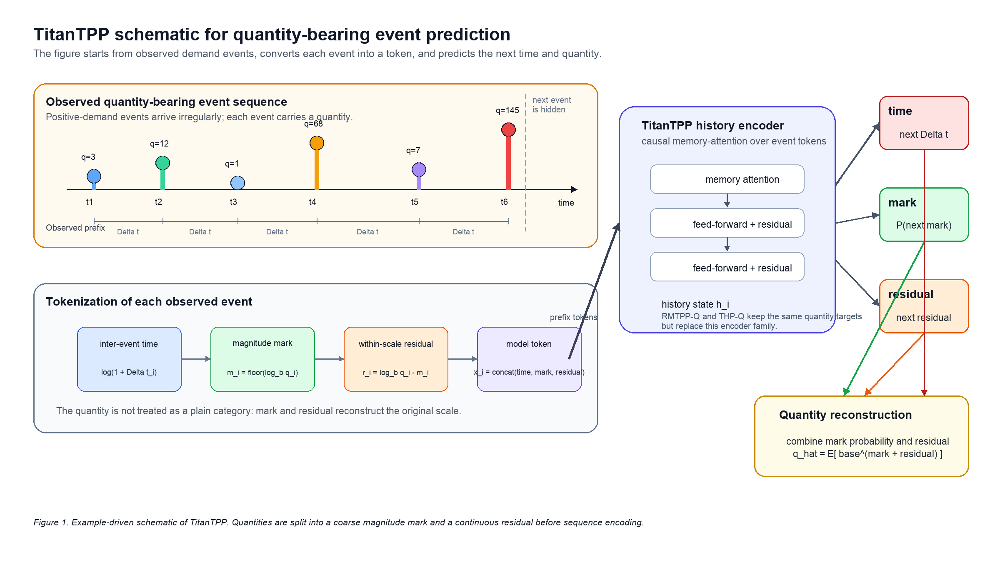

# TitanTPP: Quantity-Aware Temporal Point Process Modeling for Intermittent Demand

> Manuscript version: v0.6
> Date: 2026-08-10 KST
> Target format: ICTC 2026, IEEE two-column short paper
> Evidence scope: fixed-split validation results; the held-out test split has not been used

## Abstract

Demand for slow-moving items and long-tail products consists of irregularly timed orders whose positive quantities vary substantially. Neural temporal point processes provide a natural event-based formulation, but common models summarize history through recurrence and treat marks as categories, whereas demand quantity is continuous and often long-tailed. We propose TitanTPP, a quantity-aware temporal point process that combines a Titan-inspired causal memory-attention encoder with a log-magnitude mark and a within-mark residual. The two quantity components reconstruct demand on its original scale, and selected quantity gradients can be separated from the mark path when tail errors interfere with likelihood learning. We compare TitanTPP with adapted RMTPP and THP baselines under fixed chronological splits and three seeds. On Taxi, TitanTPP reduces validation quantity MAE from 65.8580 and 87.7508 to 23.7722 while obtaining the lowest validation NLL. On Instacart, it obtains the lowest quantity MAE, 4.3025, although adapted RMTPP retains the best likelihood and event-time error. The results show that the benefit is substantial on long, heavy-tailed event sequences but more limited on shorter sequences.

**Keywords:** temporal point process, intermittent demand, marked event sequence, quantity prediction, long-tail regression

## 1. Introduction

Demand for slow-moving items such as spare parts and long-tail retail products is intermittent: long stretches with no orders are punctuated by irregularly timed events of varying size. Conventional time-series representations turn these intervals into repeated zeros, which can obscure the distinction between when demand occurs and how much is requested. Intermittent-demand methods have long recognized this distinction [1], and probabilistic renewal models connect it to event-arrival modeling [2]. An event-based forecasting model should therefore estimate both the waiting time to the next positive-demand event and its continuous quantity.

Classical temporal point processes describe event arrivals through a conditional intensity whose response to history is usually specified by parametric or kernel-based forms [3], [4]. These models are useful when the history effect is known, but hand-designed responses are less flexible for nonlinear trajectories. Deep neural temporal point processes instead learn representations of observed event histories [5], [6], [9]. RMTPP is an early example: a recurrent state embeds prior events and supports joint prediction of the next event time and categorical mark [5]. Applying this interface to demand events raises three challenges. First, a fixed-dimensional recurrent state must carry both old demand patterns and recent changes through a long update chain. Second, a categorical mark can encode an event type or a coarse quantity range, but it cannot recover continuous variation within that range. Third, direct regression on raw quantity gives rare large events disproportionate influence; the resulting gradient scale can conflict with the time and mark objectives that share the same representation [12].

We propose TitanTPP to address these challenges. TitanTPP replaces the recurrent history state with a Titan-inspired causal memory-attention encoder and represents each positive quantity as a coarse log-magnitude mark plus a continuous residual. A differentiable decoder reconstructs the original quantity, while a configurable stop-gradient prevents the quantity loss from changing mark probabilities in settings where tail errors dominate. The resulting model retains the next-event interface of a marked temporal point process but supports continuous quantity prediction. Our study makes three contributions: an event formulation for jointly predicting arrival time and quantity, a reversible mark-residual representation for long-tailed positive demand, and a memory-oriented TPP architecture evaluated against recurrent and attention-based baselines. Validation results show a clear improvement in likelihood and quantity reconstruction on Taxi, while the smaller gain on Instacart establishes a more limited, dataset-dependent conclusion.

## 2. Related Work

Neural temporal point processes replace fixed history responses with learned sequence representations. RMTPP uses recurrence to map event history to a vector before predicting the next time and mark [5], and Neural Hawkes extends recurrent modeling to continuous-time LSTM dynamics [6]. Self-Attentive Hawkes Process and Transformer Hawkes Process use attention and temporal encodings to model dependencies among earlier events [7], [8]. Reviews of neural TPPs distinguish the history encoder from the time and mark decoders and show that categorical event types remain the usual mark space [9]. TitanTPP belongs to this neural TPP family, but its encoder uses causal memory attention and persistent learned memory. The design is influenced by Titans [10]; it does not reproduce the test-time learning mechanism of the original architecture.

Intermittent-demand forecasting provides a complementary line of work. Croston separates nonzero demand size from the interval between nonzero observations [1], while deep renewal processes model sparse demand through probabilistic arrival and size distributions [2]. These approaches motivate separate occurrence and size prediction, but they do not address the categorical-mark interface of neural TPPs. TitanTPP instead treats each positive demand as a marked event and decomposes its continuous quantity after a log-scale transformation, following the general motivation for transforming skewed positive data [11].

## 3. Method

### 3.1 Event and quantity formulation

For one demand series, let $e_i=(t_i,q_i)$ denote its $i$-th positive-demand event, where $t_i$ is the event time and $q_i>0$ is the observed quantity. The history available after event $i$ is

$$
\mathcal{H}_i=\{(t_j,q_j)\}_{j=1}^{i},
$$

and the inter-event time is $\Delta t_i=t_i-t_{i-1}$. Given $\mathcal{H}_i$, the task is to predict $\Delta t_{i+1}$ and $q_{i+1}$. Periods with no demand are represented by the waiting time rather than inserted as zero-valued events.

Positive quantities can span several orders of magnitude. A raw regression loss is then governed by absolute scale, so a small number of tail observations may dominate many ordinary events. Pure categorization has the opposite problem: it controls scale but discards within-bin variation. TitanTPP combines the two representations. For a dataset-specific base $b>1$ and highest magnitude class $M$, it defines

$$
m_i=\min\!\left(\left\lfloor\log_b q_i\right\rfloor,M\right),
\qquad
r_i=\log_b q_i-m_i.
$$

The transformation is reversible:

$$
q_i=b^{m_i+r_i}.
$$

The clipped tail class does not truncate quantity because $r_i$ may exceed one when $m_i=M$. Thus, $m_i$ captures coarse scale and $r_i$ preserves continuous variation without requiring a single raw-scale regression head to cover the full range.

### 3.2 History representation

Each observed event is converted into a token

$$
x_i=\left[E_m(m_i)\,\|\,\log(1+\Delta t_i)\,\|\,W_r r_i\right],
$$

where $E_m$ is the magnitude-mark embedding and $W_r$ projects the residual. A causal memory-attention encoder maps the observed prefix to history states,

$$
(h_1,\ldots,h_i)=F_{\theta}(x_1,\ldots,x_i;P),
$$

where $P$ is a learned persistent memory bank. The encoder contains causal memory-attention and feed-forward sublayers with residual connections. A static learned-memory module then refines the encoded states. This implementation uses fixed learned memory during inference and does not update model memory on validation or test events. It should therefore be understood as a Titan-inspired history encoder, not as the original Titans test-time learning procedure [10].

Figure 1 follows one observed sequence through the model. Inter-event time, magnitude mark, and residual form the event token; the encoder summarizes the observed prefix; and three prediction paths estimate the next time, magnitude distribution, and residual needed for quantity reconstruction.

*Figure 1. Example-driven schematic of TitanTPP for a quantity-bearing event sequence.*

### 3.3 Prediction heads and training objective

The mark head predicts the next magnitude class from $h_i$:

$$
p_{i,k}=P(m_{i+1}=k\mid\mathcal{H}_i)
=\operatorname{softmax}(W_mh_i+b_m)_k.
$$

The event-time head follows the RMTPP density. Let $a_i=v_t^{\top}h_i+b_t$ and $w=\operatorname{softplus}(w_{\mathrm{raw}})+\epsilon$. For $d=\Delta t_{i+1}$,

$$
\log f(d\mid\mathcal{H}_i)
=a_i+wd-\frac{\exp(a_i)}{w}\left(\exp(wd)-1\right).
$$

The quantity head predicts a residual for each possible magnitude class. Its mark-conditioned form is

$$
\widehat r_{i,k}=g_{\mathrm{s}}(h_i)+g_k(h_i),
$$

where $g_{\mathrm{s}}$ is shared and $g_k$ is a class-specific correction. Setting $g_k=0$ gives the shared-head configuration. The expected quantity on the original scale is

$$
\widehat q_{i+1}
=\sum_{k=0}^{M}\widetilde p_{i,k}\,b^{k+\widehat r_{i,k}}.
$$

Here $\widetilde p_{i,k}=p_{i,k}$ under coupled training. In the detached configuration, $\widetilde p_{i,k}=\operatorname{sg}(p_{i,k})$, where $\operatorname{sg}$ is the stop-gradient operator. Detachment changes only the backward path from quantity reconstruction to mark logits; the forward prediction is unchanged.

The mark and time losses are

$$
\mathcal{L}_{\mathrm{mark}}
=-\frac{1}{N}\sum_i\log p_{i,m_{i+1}},
$$

$$
\mathcal{L}_{\mathrm{time}}
=-\frac{1}{N}\sum_i\log f(\Delta t_{i+1}\mid\mathcal{H}_i).
$$

Residual supervision uses the true next magnitude class,

$$
\mathcal{L}_{\mathrm{res}}
=\frac{1}{N}\sum_i
\operatorname{Huber}(\widehat r_{i,m_{i+1}},r_{i+1}),
$$

and original-scale reconstruction is trained with

$$
\mathcal{L}_{\mathrm{qty}}
=\frac{1}{N}\sum_i
\operatorname{Huber}\!\left(\frac{\widehat q_{i+1}}{s_q},
\frac{q_{i+1}}{s_q}\right),
$$

where $s_q=1$ in the reported configurations. The configurations evaluated in this paper minimize

$$
\mathcal{L}_{\mathrm{train}}
=\mathcal{L}_{\mathrm{mark}}
+\mathcal{L}_{\mathrm{time}}
+\mathcal{L}_{\mathrm{res}}
+\lambda_q\mathcal{L}_{\mathrm{qty}},
\qquad \lambda_q=0.25.
$$

Checkpoint selection uses the validation event NLL,
$\mathcal{L}_{\mathrm{NLL}}=\mathcal{L}_{\mathrm{mark}}+\mathcal{L}_{\mathrm{time}}$,
so quantity errors do not determine which epoch is selected.

## 4. Experiments

### 4.1 Datasets, baselines, and protocol

We evaluate Taxi and Instacart, which differ sharply in sequence length and quantity range. Taxi contains long event histories and a pronounced quantity tail; Instacart contains many shorter user-level sequences with a narrower positive-quantity range. Table 1 reports statistics computed from the frozen dataset manifests.

| Dataset | Sequences | Events | Sequence length med./p95/max | Quantity med./p95/max | Magnitude marks | Base $b$ |
|---|---:|---:|---:|---:|---:|---:|
| Taxi | 131 | 55,119 | 405 / 743 / 744 | 7 / 1,547 / 6,489 | 4 | 10 |
| Instacart | 206,209 | 3,279,521 | 10 / 50 / 100 | 8 / 25 / 177 | 8 | 2 |

*Table 1. Dataset statistics. The padding symbol is not counted as a magnitude mark.*

The comparison includes **Adapted RMTPP**, **Adapted THP**, and **TitanTPP**. The first two are not unmodified reproductions of their original papers. Original RMTPP and THP predict event time and a categorical event type [5], [8]. Our adapted variants retain the GRU and Transformer history encoders, respectively, but use the same log-magnitude target, residual quantity input, reconstruction rule, and hybrid loss required by the demand task. This adaptation prevents the comparison from penalizing a baseline merely because its original output space cannot reconstruct continuous quantity.

For Taxi, the recurrent baseline uses a 128-dimensional GRU, THP uses three 128-dimensional four-head layers, and TitanTPP uses two 128-dimensional four-head layers with 32 persistent tokens and a 128-slot learned-memory module. For Instacart, the recurrent hidden size is 64, while THP and TitanTPP use two 64-dimensional four-head layers; TitanTPP uses 16 persistent tokens and a 64-slot learned-memory module. Maximum input lengths are 256 and 64 events, respectively.

All models use the same fixed chronological splits, seeds 42, 52, and 62, AdamW with a learning rate of 0.001, batch size 128, and a maximum budget of 300 epochs. The selected checkpoint minimizes validation event NLL. Results are the mean $\pm$ sample standard deviation across the three seeds. Hyperparameters and checkpoint epochs are determined without using the held-out test split. Taxi TitanTPP uses mark-conditioned residual experts and detached quantity-to-mark gradients; Instacart uses a shared residual head with coupled gradients. Consequently, the main comparison evaluates complete model configurations rather than attributing every difference to the history encoder alone.

### 4.2 Validation results

Table 2 reports Taxi results. TitanTPP obtains the lowest event NLL, quantity MAE, and the highest mark accuracy. Its quantity MAE is 63.9% lower than Adapted RMTPP and 72.9% lower than Adapted THP. Adapted RMTPP remains slightly better on inter-event-time MAE, so the result does not support uniform superiority across all targets.

| Model | Val. NLL $\downarrow$ | Quantity MAE $\downarrow$ | $\Delta t$ MAE $\downarrow$ | Mark accuracy $\uparrow$ |
|---|---:|---:|---:|---:|
| Adapted RMTPP | 1.5803 $\pm$ 0.0032 | 65.8580 $\pm$ 2.4748 | **0.7326 $\pm$ 0.0085** | 91.800% $\pm$ 0.117%p |
| Adapted THP | 1.5998 $\pm$ 0.0087 | 87.7508 $\pm$ 2.6771 | 0.7528 $\pm$ 0.0224 | 91.461% $\pm$ 0.202%p |
| **TitanTPP** | **1.5458 $\pm$ 0.0048** | **23.7722 $\pm$ 1.0929** | 0.7374 $\pm$ 0.0151 | **92.606% $\pm$ 0.134%p** |

*Table 2. Taxi validation results over three seeds.*

Table 3 shows a different pattern on Instacart. TitanTPP obtains the lowest quantity MAE, improving on Adapted RMTPP by 0.8% and on Adapted THP by 0.05%. The difference from Adapted THP is small relative to the seed variation. Adapted RMTPP obtains the best NLL, inter-event-time MAE, and mark accuracy. The Instacart result therefore supports only a narrow claim about quantity reconstruction; it does not show a general likelihood advantage.

| Model | Val. NLL $\downarrow$ | Quantity MAE $\downarrow$ | $\Delta t$ MAE $\downarrow$ | Mark accuracy $\uparrow$ |
|---|---:|---:|---:|---:|
| **Adapted RMTPP** | **4.3809 $\pm$ 0.0007** | 4.3379 $\pm$ 0.0131 | **5.6690 $\pm$ 0.0094** | **49.940% $\pm$ 0.034%p** |
| Adapted THP | 4.3881 $\pm$ 0.0009 | 4.3046 $\pm$ 0.0081 | 5.7063 $\pm$ 0.0059 | 49.793% $\pm$ 0.091%p |
| TitanTPP | 4.3827 $\pm$ 0.0012 | **4.3025 $\pm$ 0.0070** | 5.6827 $\pm$ 0.0027 | 49.809% $\pm$ 0.034%p |

*Table 3. Instacart validation results over three seeds.*

The contrast between the datasets is consistent with their structure. Taxi has substantially longer histories and a heavier quantity tail, which are the conditions targeted by memory-oriented history encoding and scale-aware quantity reconstruction. Instacart has shorter sequences and a narrower quantity range, and the measured advantage is correspondingly limited. This observation is an interpretation of the two datasets rather than a causal component attribution.

### 4.3 Quantity-representation analysis

To separate the proposed quantity representation from the encoder comparison, the ablation fixes an RMTPP history encoder and varies only the quantity interface: uniform categorical bins, train-split quantile bins, direct raw-quantity regression trained with squared error, and the proposed log-magnitude mark with a residual decoder. Uniform bins test the loss of resolution near common small quantities; quantile bins test whether balanced classes distort original-scale distances; direct regression tests sensitivity to tail scale; and the mark-residual model tests whether coarse scale and within-scale variation can be learned together. The comparison uses the same fixed split, seeds, epoch budget, and validation checkpoint rule. Overall error is accompanied by quantity MAE within train-derived validation strata $[0,p_{50}]$, $(p_{50},p_{90}]$, $(p_{90},p_{95}]$, $(p_{95},p_{99}]$, and $(p_{99},\max]$ so that tail behavior is visible rather than repeated in a second aggregate bar chart.

<!-- Submission blocker: insert the completed quantity-interface ablation table and a tail-quantile Figure 2. Do not derive bins from the held-out test split. -->

## 5. Conclusion

TitanTPP formulates positive demand as a quantity-bearing event and predicts both its arrival time and continuous size. Its log-magnitude mark and residual preserve original-scale quantity, while the causal memory-attention encoder provides an alternative to recurrent history compression. Under fixed-split validation, TitanTPP substantially improves likelihood and quantity reconstruction on Taxi. On Instacart, it produces only a small quantity-MAE improvement and does not improve likelihood. These results support a dataset-dependent conclusion: the proposed configuration is most useful when event histories are long and positive quantities are strongly long-tailed. A controlled quantity-interface ablation and one final held-out test evaluation are required before attributing the gains to individual components.

## References

[1] J. D. Croston, "Forecasting and Stock Control for Intermittent Demands," *Operational Research Quarterly*, vol. 23, no. 3, pp. 289-303, 1972, doi: 10.1057/jors.1972.50.

[2] A. C. Türkmen, T. Januschowski, Y. Wang, and A. T. Cemgil, "Forecasting Intermittent and Sparse Time Series: A Unified Probabilistic Framework via Deep Renewal Processes," *PLOS ONE*, vol. 16, no. 11, e0259764, 2021, doi: 10.1371/journal.pone.0259764.

[3] D. J. Daley and D. Vere-Jones, *An Introduction to the Theory of Point Processes, Volume I: Elementary Theory and Methods*, 2nd ed. New York, NY, USA: Springer, 2003, doi: 10.1007/b97277.

[4] A. G. Hawkes, "Spectra of Some Self-Exciting and Mutually Exciting Point Processes," *Biometrika*, vol. 58, no. 1, pp. 83-90, 1971, doi: 10.1093/biomet/58.1.83.

[5] N. Du, H. Dai, R. Trivedi, U. Upadhyay, M. Gomez-Rodriguez, and L. Song, "Recurrent Marked Temporal Point Processes: Embedding Event History to Vector," in *Proc. 22nd ACM SIGKDD Int. Conf. Knowledge Discovery and Data Mining*, 2016, pp. 1555-1564, doi: 10.1145/2939672.2939875.

[6] H. Mei and J. Eisner, "The Neural Hawkes Process: A Neurally Self-Modulating Multivariate Point Process," in *Advances in Neural Information Processing Systems*, vol. 30, 2017.

[7] Q. Zhang, A. Lipani, O. Kirnap, and E. Yilmaz, "Self-Attentive Hawkes Process," in *Proc. 37th Int. Conf. Machine Learning*, PMLR, vol. 119, 2020, pp. 11183-11193.

[8] S. Zuo, H. Jiang, Z. Li, T. Zhao, and H. Zha, "Transformer Hawkes Process," in *Proc. 37th Int. Conf. Machine Learning*, PMLR, vol. 119, 2020, pp. 11692-11702.

[9] O. Shchur, A. C. Türkmen, T. Januschowski, and S. Günnemann, "Neural Temporal Point Processes: A Review," in *Proc. 30th Int. Joint Conf. Artificial Intelligence*, 2021, pp. 4585-4593, doi: 10.24963/ijcai.2021/623.

[10] A. Behrouz, P. Zhong, and V. Mirrokni, "Titans: Learning to Memorize at Test Time," in *Advances in Neural Information Processing Systems*, vol. 38, 2025.

[11] G. E. P. Box and D. R. Cox, "An Analysis of Transformations," *Journal of the Royal Statistical Society: Series B*, vol. 26, no. 2, pp. 211-243, 1964, doi: 10.1111/j.2517-6161.1964.tb00553.x.

[12] T. Yu, S. Kumar, A. Gupta, S. Levine, K. Hausman, and C. Finn, "Gradient Surgery for Multi-Task Learning," in *Advances in Neural Information Processing Systems*, vol. 33, 2020, pp. 5824-5836.
