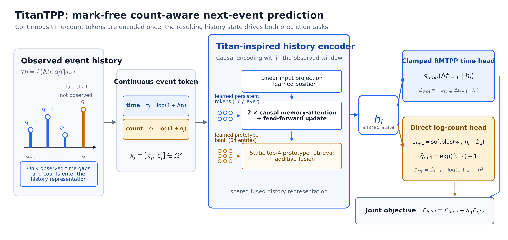
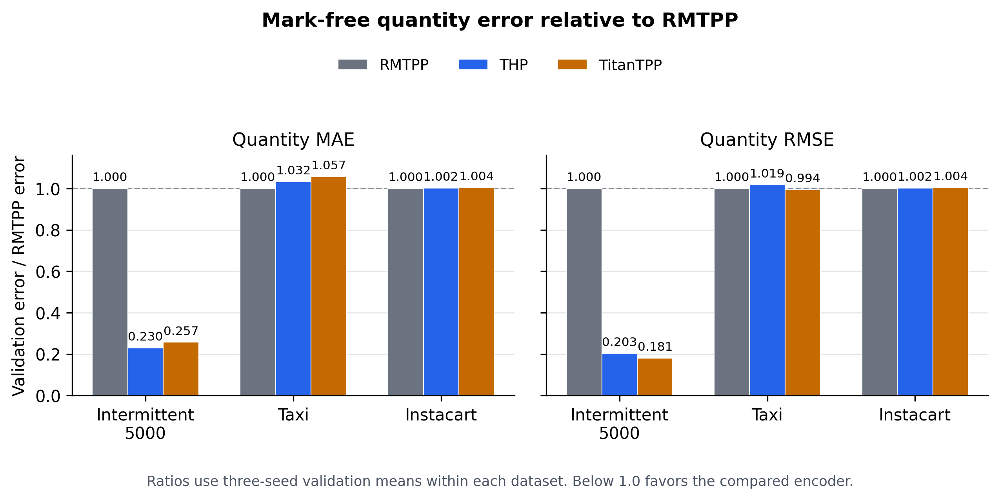

# TitanTPP: A controlled evaluation of Titan-inspired memory for continuous-count temporal point processes

> Manuscript version: v0.7 validation freeze
> Date: 2026-09-05 KST
> Evidence scope: fixed-split validation, three seeds; held-out test not evaluated
> Frozen model: original mark-free Hard-LMM, reported as Count-aware TitanTPP

## Abstract

Demand events carry a positive quantity as well as an arrival time, yet neural temporal point processes usually treat the event mark as a category. We examine whether a Titan-inspired history encoder improves continuous-count prediction when the quantity interface is fixed across models. Count-aware TitanTPP encodes each observed event with its log-transformed time gap and quantity. A causal encoder with persistent tokens and static top-k prototype retrieval produces the history state used by a common clamped RMTPP time-score head and a direct log-count regression head. We compare GRU-based RMTPP, Transformer-based THP, and TitanTPP under matched inputs, heads, losses, optimization, checkpoint selection, and three random seeds. On the Intermittent-5000 validation split, TitanTPP reduces quantity MAE and RMSE by 74.3% and 81.9% relative to RMTPP. Against THP, however, it lowers RMSE by 10.8% while increasing MAE by 12.1%. Taxi yields a smaller trade-off: TitanTPP records the lowest mean RMSE but trails RMTPP in MAE and the joint objective. On Instacart, RMTPP leads all aggregate metrics. These results establish a strong recurrent-baseline improvement on one dataset, but they do not support uniform superiority over attention or across datasets. The observed variation is reported as a dataset- and metric-dependent boundary rather than a causal long-history or heavy-tail effect.

**Keywords:** temporal point process, intermittent demand, continuous count, quantity prediction, memory attention

## 1. Introduction

Intermittent demand consists of positive orders separated by periods without demand. A useful event model must therefore estimate both the time of the next positive event and its quantity. Classical intermittent-demand methods separate occurrence intervals from nonzero demand sizes [1], while renewal models provide a probabilistic version of the same decomposition [2]. Temporal point processes offer a related event-based formulation in which the observed history conditions the next arrival [3], [4].

Neural temporal point processes learn this history representation rather than prescribing it. RMTPP compresses the event prefix into a recurrent state [5], Neural Hawkes models continuous-time recurrent dynamics [6], and SAHP and THP replace recurrence with attention [7], [8]. Their standard mark interface is categorical, whereas a demand quantity is numeric and must be evaluated on its original scale [9]. Converting quantity into a category introduces bin boundaries and requires a separate reconstruction rule.

This study fixes a mark-free continuous-count interface before comparing history encoders. Each model receives the same transformed time and quantity observations, predicts the same two targets, and uses the same training and checkpoint objective. The controlled comparison asks whether a Titan-inspired encoder changes count error relative to recurrent RMTPP and causal THP. TitanTPP uses persistent tokens and a static learned prototype bank, but it does not implement the test-time memory updates of Titans [10].

The study contributes a controlled count-aware TPP protocol and a three-dataset assessment of the resulting encoder trade-offs. Intermittent-5000 supplies the primary RMTPP comparison, Taxi tests the same model under a wider quantity range, and Instacart provides a large short-context boundary. Results are reported by metric and seed. Because the validation evidence does not isolate sequence length or tail weight as causal factors, the paper does not claim a general long-memory advantage.

## 2. Related work

Point processes describe event arrivals through a conditional intensity or density conditioned on history [3], [4]. Neural variants parameterize this dependence with recurrent or attention-based encoders. RMTPP jointly predicts the next event time and mark from a recurrent state [5]. Neural Hawkes introduces continuous-time LSTM dynamics [6], whereas SAHP and THP use attention and temporal encodings [7], [8]. Reviews of neural TPPs distinguish the history encoder from the event-time and mark decoders, a separation that motivates the controlled design used here [9].

Intermittent-demand forecasting provides the application context. Croston's method separates nonzero demand size from the interval between nonzero observations [1], and deep renewal processes estimate both components probabilistically [2]. Count-aware TitanTPP adopts the event-level decomposition but predicts a continuous quantity directly. The log transformation reduces scale variation in the regression target [11]. Its use is a shared experimental interface in this paper, not an empirical claim that direct regression always outperforms categorical binning.

Titans proposes learned memory mechanisms that adapt at test time [10]. Our encoder draws only on the idea of augmenting causal attention with learned memory. Its prototype bank remains fixed during validation and inference. We therefore use the name Titan-inspired and distinguish the implementation from the original Titans memory procedure.

## 3. Method

### 3.1 Mark-free event formulation

For one series, let $e_i=(t_i,q_i)$ denote the $i$-th positive-demand event, where $t_i$ is its time and $q_i>0$ is its quantity. The observed history is

$$
\mathcal H_i=\{(t_j,q_j)\}_{j=1}^{i},
$$

and $\Delta t_i=t_i-t_{i-1}$. Given $\mathcal H_i$, the task predicts $\Delta t_{i+1}$ and $q_{i+1}$. Periods without demand are represented by the elapsed time between positive events.

Every observed event becomes a two-dimensional continuous token,

$$
x_i=\left[\log(1+\Delta t_i),\;\log(1+q_i)\right].
$$

The target event is excluded from the history token. Product identity, quantity-derived classes, magnitude marks, and within-bin residuals are absent from the main model.

### 3.2 Matched history encoders

Three encoders map the observed prefix to a history state $h_i$. Count-aware RMTPP uses a one-layer GRU, and Count-aware THP uses a two-layer causal Transformer. Count-aware TitanTPP uses two causal memory-attention blocks with 16 learned persistent tokens per layer. A static bank of 64 learned prototypes retrieves the top four entries for each state and adds the retrieved value to the causal representation. All encoders use hidden dimension 64.

The prototype bank contains learned parameters rather than event-specific external storage. It does not update from validation or held-out observations. Separate-key retrieval and elapsed-age variants were evaluated only as exploratory candidates and are not part of the frozen model.

*Figure 1. Count-aware TitanTPP maps observed log-time and log-count tokens to one causal history state. The state drives the shared event-time interface and direct log-count head. Persistent tokens and static top-four prototype retrieval belong to the Titan-inspired encoder; the prototype bank does not update at inference.*

### 3.3 Prediction heads and objective

The frozen event-time branch uses the implementation's `legacy_clamped_rmtpp` score. Let
$r_i=v_t^\top h_i+b_t$, $a_i=\min(r_i,300)$,
$w=\operatorname{softplus}(w_{\mathrm{raw}})+10^{-3}$, and
$u=\min(w\Delta t_{i+1},10)$. The per-event score is

$$
s_{\mathrm{time}}(\Delta t_{i+1}\mid\mathcal H_i)
=a_i+u-\frac{\exp(a_i)}{w}\left(\exp(u)-1\right).
$$

Without active clamps, this expression equals the RMTPP log density. The cap on $u$ means
the frozen score is not guaranteed to integrate to a normalized density when the cap is
active. We therefore report its negative mean as **clamped time loss**. The source artifacts
retain the historical field name `time_nll` for provenance.

The value 300 reflects the three source revisions that produced the frozen validation
checkpoints. A later code revision changed the default effective intercept cap to 30. Any
held-out replay must use the recorded source revision or an output-equivalent cap-300
compatibility path; applying the current default would change the evaluation contract.

The quantity head predicts a nonnegative log-count location and restores the point prediction to the raw scale,

$$
\hat z_{i+1}=\operatorname{softplus}(w_q^\top h_i+b_q),
\qquad
\hat q_{i+1}=\exp(\hat z_{i+1})-1.
$$

The quantity-head weight starts at zero, and its bias follows the same rule in every run:
the inverse-softplus transform of the train-split mean log count. The resulting bias value
is dataset-fitted, while its initialization rule remains fixed.

Training and validation checkpoint selection use

$$
\mathcal L_{\mathrm{joint}}
=\mathcal L_{\mathrm{time}}
+\lambda_q\operatorname{MSE}\!\left(\hat z,\log(1+q)\right),
\qquad \lambda_q=1.
$$

Clamped time loss and log-count MSE are reported separately. Raw quantity MAE and RMSE evaluate the common point prediction.

## 4. Experiments

### 4.1 Data and protocol

The evaluation uses fixed chronological splits from three datasets. Intermittent-5000 is a frozen sample of 5,000 eligible part series used for the primary controlled comparison. Taxi aggregates pickups by grid cell and hour, and Instacart represents each user order as an event whose quantity is the basket size. Table 1 describes the exact files used by the mark-free experiments rather than the earlier full Intermittent corpus.

| Dataset | Sequences | Event rows | Train / validation / test rows | Train sequence length median / p95 / max | Train quantity median / p95 / max |
| --- | ---: | ---: | ---: | ---: | ---: |
| Intermittent-5000 | 5,000 | 573,128 | 398,824 / 86,285 / 88,019 | 62 / 182 / 193 | 2 / 46 / 477 |
| Taxi | 131 | 55,119 | 38,524 / 8,268 / 8,327 | 283 / 520 / 520 | 7 / 1,562 / 6,322 |
| Instacart | 206,209 | 3,279,521 | 2,197,401 / 503,733 / 578,387 | 7 / 35 / 70 | 8 / 25 / 175 |

*Table 1. Frozen dataset statistics. Population and split counts identify the complete files; sequence-length and quantity distributions use train rows only. No held-out target statistic or model prediction is included. Quantity strata used in diagnostics are also fitted on the train split.*

The history windows follow each dataset's time unit. Intermittent-5000 uses 520 weeks and at most 256 events, Taxi uses 168 hours and at most 256 events, and Instacart uses 52 days and at most 64 events. These context ranges apply to every backbone within a dataset. Model inputs, hidden dimension, heads, losses, optimizer, and selection rule remain fixed.

All runs use seeds 42, 52, and 62, AdamW with learning rate $10^{-3}$, batch size 128, gradient clipping at 1.0, a maximum of 300 epochs, and early stopping after a minimum of 40 epochs with patience 40. The selected checkpoint minimizes validation joint objective. Table 2 reports means and sample standard deviations across seeds. Test rows contribute only to the frozen dataset counts in Table 1; they have not been used for model selection or predictive evaluation.

### 4.2 Three-seed validation results

| Dataset | Model | Clamped time loss $\downarrow$ | Log-count MSE $\downarrow$ | Quantity MAE $\downarrow$ | Quantity RMSE $\downarrow$ |
| --- | --- | ---: | ---: | ---: | ---: |
| Intermittent-5000 | RMTPP | $-3.599494\pm0.000000$ | $0.010517\pm0.000854$ | $2.9025\pm0.1703$ | $10.5787\pm0.6047$ |
|  | THP | $-3.599485\pm0.000004$ | **$0.004184\pm0.000153$** | **$0.6664\pm0.0819$** | $2.1507\pm0.5552$ |
|  | TitanTPP | $-3.593078\pm0.000661$ | $0.007050\pm0.000633$ | $0.7469\pm0.0685$ | **$1.9195\pm0.2938$** |
| Taxi | RMTPP | **$1.359763\pm0.001960$** | **$0.184898\pm0.001350$** | **$40.2893\pm3.2321$** | $144.8148\pm14.0054$ |
|  | THP | $1.362396\pm0.002819$ | $0.194915\pm0.006842$ | $41.5884\pm2.9369$ | $147.4963\pm10.2086$ |
|  | TitanTPP | $1.365797\pm0.001465$ | $0.190733\pm0.001819$ | $42.5805\pm8.0971$ | **$143.9931\pm32.5312$** |
| Instacart | RMTPP | **$3.205289\pm0.000846$** | **$0.243269\pm0.000244$** | **$4.0270\pm0.0303$** | **$5.9901\pm0.0669$** |
|  | THP | $3.206215\pm0.000547$ | $0.245422\pm0.001697$ | $4.0368\pm0.0270$ | $6.0012\pm0.0625$ |
|  | TitanTPP | $3.206516\pm0.000151$ | $0.244365\pm0.000680$ | $4.0450\pm0.0166$ | $6.0159\pm0.0374$ |

*Table 2. Fixed-split validation results over three seeds. Lower is better. The three rows within each dataset share the mark-free input, prediction heads, loss, training budget, and checkpoint rule; only the history encoder changes.*

On Intermittent-5000, TitanTPP lowers quantity MAE by 74.3% and RMSE by 81.9% relative to RMTPP, and both improvements occur in all three paired seeds. THP defines a stricter boundary. TitanTPP lowers RMSE by 10.8% and does so in all three seeds, but its MAE is 12.1% higher and loses in all three paired comparisons. Its clamped time loss is 0.0064 higher than RMTPP, within the pre-specified tolerance of 0.01.

Taxi does not reproduce the Intermittent-5000 effect. TitanTPP has the lowest mean RMSE, 143.99 compared with 144.81 for RMTPP, but the reduction is 0.57% and its sample standard deviation is more than twice as large. RMSE improves over RMTPP in two seeds, whereas MAE improves in one. RMTPP retains the lowest mean MAE, clamped time loss, log-count MSE, and validation joint objective.

Instacart provides a null or negative boundary under the same architecture. RMTPP leads all four reported metrics. TitanTPP has higher MAE in every paired seed and lower RMSE in only one of three. Its aggregate quantity errors remain close to THP, so the result indicates competitiveness rather than an improvement.

*Figure 2. Three-seed validation quantity MAE and RMSE relative to RMTPP within each dataset. A ratio below one favors the compared encoder. The figure displays dataset-level relative errors because the final claim concerns cross-dataset variation; raw values and sample standard deviations appear in Table 2.*

### 4.3 Error regimes and diagnostic boundary

Quantity-stratified results on Intermittent-5000 place TitanTPP's largest RMSE advantage over THP in the largest train-defined target-quantity stratum, $q>187$, but the model does not improve every upper-quantity stratum or every metric. The [complete three-dataset stratum table](tables/T5_v0_7_quantity_strata_validation.md) reports identical validation-target membership across models, seed means, and sample standard deviations. History-stratified results are more restrictive. For histories longer than 128 events, TitanTPP has higher MAE than RMTPP and THP in all three seeds, and its RMSE reduction relative to RMTPP is smaller than in the shortest stratum. The registered long-history gate therefore fails.

Taxi has longer observed sequences and a wider quantity range than Instacart, yet the dataset contrast cannot identify which property accounts for their different outcomes. Sequence construction, event semantics, target distribution, sample size, and context truncation change together. Separate-key retrieval improved Taxi in one screening seed but failed the Instacart gate, while an elapsed-age extension failed the shared two-dataset gate. These exploratory results are not included as alternative main models.

An additional train-only probe found predictive signal in raw Instacart histories, although the matched-capacity raw-history probe did not outperform the learned encoder state or improve its frozen residuals. This finding does not establish information loss in the encoder, nor does it imply that Instacart is intrinsically unpredictable. It limits the present diagnosis to the tested representation and probe class.

### 4.4 Quantity-interface audit

The direct log-count head defines the shared output space for the backbone comparison. Earlier Taxi experiments compared categorical, raw-regression, log-regression, and magnitude-residual interfaces, but they used a marked input path, a different hidden size, and event-NLL checkpoint selection. Those runs therefore cannot establish the v0.7 claim that direct log regression is superior to a matched log-binned categorical model. We retain direct regression as the frozen common interface and remove empirical interface superiority from the contribution list. A future interface experiment would need identical mark-free history inputs, RMTPP encoder, seeds, budget, joint-objective selector, train-fitted bins, and train-fitted numeric representatives.

## 5. Discussion and limitations

The controlled results support a narrow architectural conclusion. A Titan-inspired static-memory encoder can substantially reduce count error relative to recurrent RMTPP on Intermittent-5000, but its advantage does not extend uniformly to THP, Taxi, or Instacart. RMSE and MAE also select different models on Intermittent-5000 and Taxi. Reporting both metrics is necessary because RMSE gives greater weight to rare large misses.

The dataset pattern is descriptive. Although Taxi and Intermittent-5000 expose longer contexts or wider count ranges than Instacart, the experiments do not intervene on history length or tail weight while holding the remaining data-generating process fixed. No causal mechanism follows from the cross-dataset comparison. The failed long-history gate reinforces this restriction.

The event-time comparison has an additional implementation boundary. Every backbone uses the same clamped RMTPP score, which keeps the encoder comparison matched, but the score is not an exact log-likelihood when its duration cap is active. The reported clamped time loss should therefore be read as a common training and selection term. Establishing likelihood-calibrated time performance would require a new experiment with a numerically stable normalized duration density.

All results in this draft come from validation splits. Model identity, metrics, checkpoint rules, tables, and figures must remain fixed before each selected checkpoint is evaluated once on held-out data. Test results may narrow the claims further; they cannot be used to select another encoder or revise the training contract.

## 6. Conclusion

Count-aware TitanTPP applies a Titan-inspired static-memory encoder to mark-free next-event time and count prediction. Under a matched direct-regression interface, it produces a large quantity-error reduction over recurrent RMTPP on Intermittent-5000 and a lower RMSE than THP, accompanied by higher MAE. Taxi shows only a small mean-RMSE advantage with substantial seed variation, and Instacart favors RMTPP. The combined evidence supports a dataset- and metric-dependent result. It does not establish general TPP superiority, a long-history mechanism, or a universal heavy-tail benefit.

## References

[1] J. D. Croston, "Forecasting and Stock Control for Intermittent Demands," *Operational Research Quarterly*, vol. 23, no. 3, pp. 289-303, 1972, doi: 10.1057/jors.1972.50.

[2] A. C. Türkmen, T. Januschowski, Y. Wang, and A. T. Cemgil, "Forecasting Intermittent and Sparse Time Series: A Unified Probabilistic Framework via Deep Renewal Processes," *PLOS ONE*, vol. 16, no. 11, e0259764, 2021, doi: 10.1371/journal.pone.0259764.

[3] D. J. Daley and D. Vere-Jones, *An Introduction to the Theory of Point Processes, Volume I: Elementary Theory and Methods*, 2nd ed. New York, NY, USA: Springer, 2003, doi: 10.1007/b97277.

[4] A. G. Hawkes, "Spectra of Some Self-Exciting and Mutually Exciting Point Processes," *Biometrika*, vol. 58, no. 1, pp. 83-90, 1971, doi: 10.1093/biomet/58.1.83.

[5] N. Du, H. Dai, R. Trivedi, U. Upadhyay, M. Gomez-Rodriguez, and L. Song, "Recurrent Marked Temporal Point Processes: Embedding Event History to Vector," in *Proc. 22nd ACM SIGKDD Int. Conf. Knowledge Discovery and Data Mining*, 2016, pp. 1555-1564, doi: 10.1145/2939672.2939875.

[6] H. Mei and J. Eisner, "The Neural Hawkes Process: A Neurally Self-Modulating Multivariate Point Process," in *Advances in Neural Information Processing Systems*, vol. 30, 2017.

[7] Q. Zhang, A. Lipani, O. Kirnap, and E. Yilmaz, "Self-Attentive Hawkes Process," in *Proc. 37th Int. Conf. Machine Learning*, PMLR, vol. 119, 2020, pp. 11183-11193.

[8] S. Zuo, H. Jiang, Z. Li, T. Zhao, H. Zha, "Transformer Hawkes Process," in *Proc. 37th Int. Conf. Machine Learning*, PMLR, vol. 119, 2020, pp. 11692-11702.

[9] O. Shchur, A. C. Türkmen, T. Januschowski, and S. Günnemann, "Neural Temporal Point Processes: A Review," in *Proc. 30th Int. Joint Conf. Artificial Intelligence*, 2021, pp. 4585-4593, doi: 10.24963/ijcai.2021/623.

[10] A. Behrouz, P. Zhong, and V. Mirrokni, "Titans: Learning to Memorize at Test Time," in *Advances in Neural Information Processing Systems*, vol. 38, 2025.

[11] G. E. P. Box and D. R. Cox, "An Analysis of Transformations," *Journal of the Royal Statistical Society: Series B*, vol. 26, no. 2, pp. 211-243, 1964, doi: 10.1111/j.2517-6161.1964.tb00553.x.
