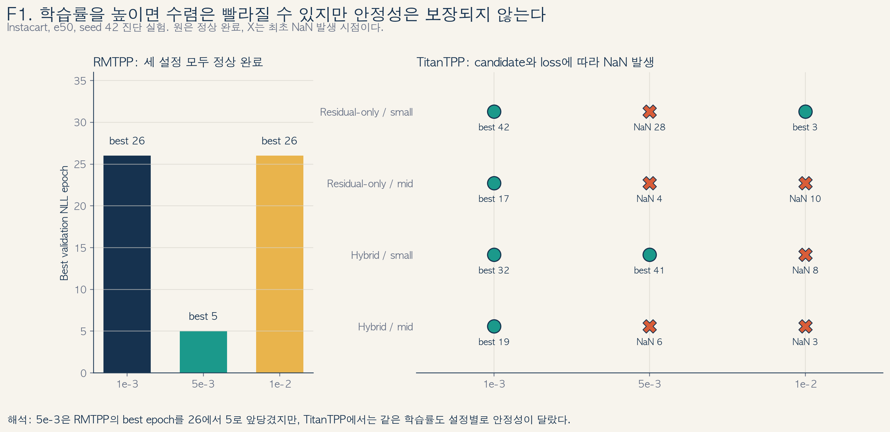
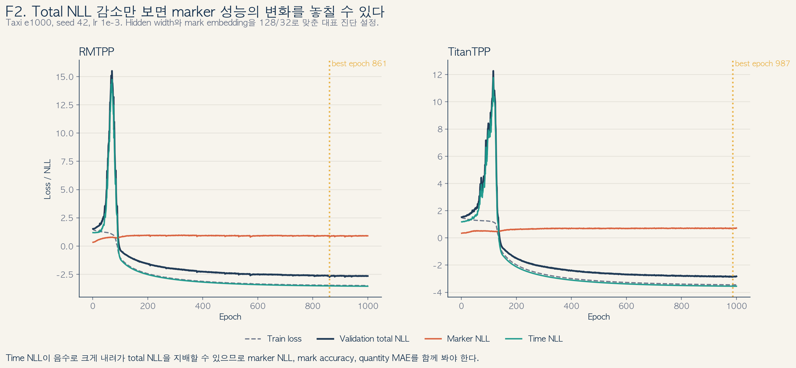
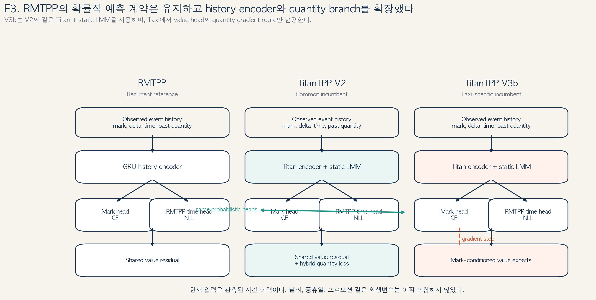
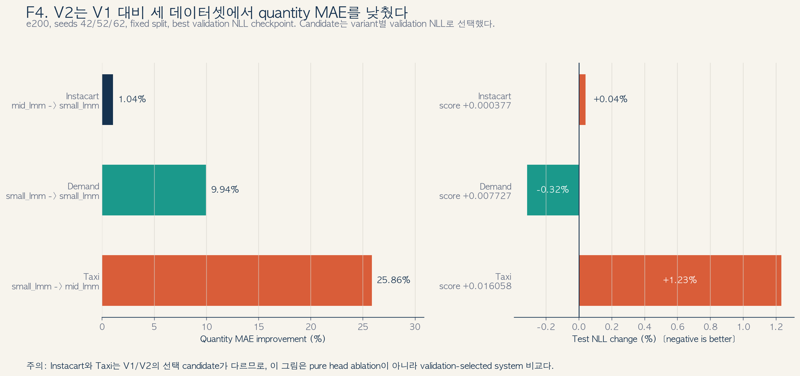
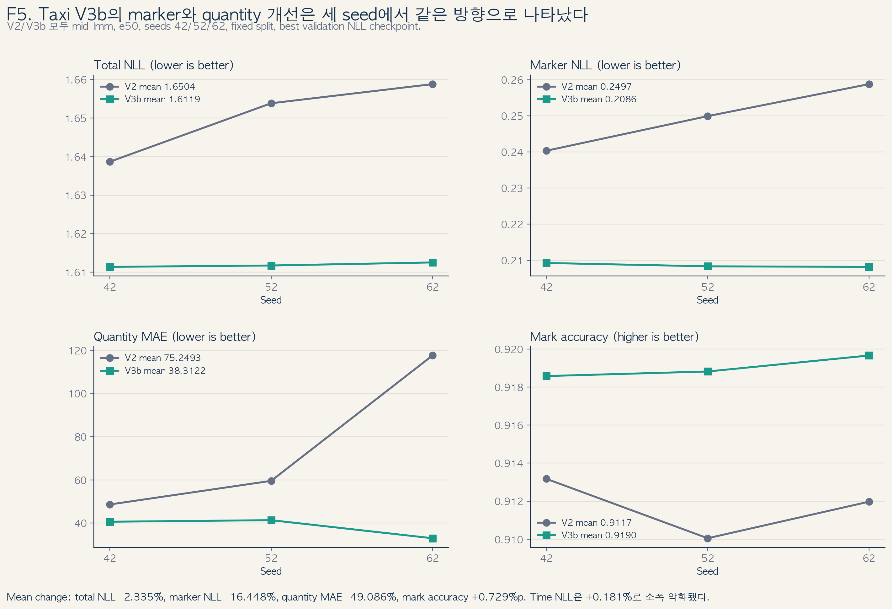
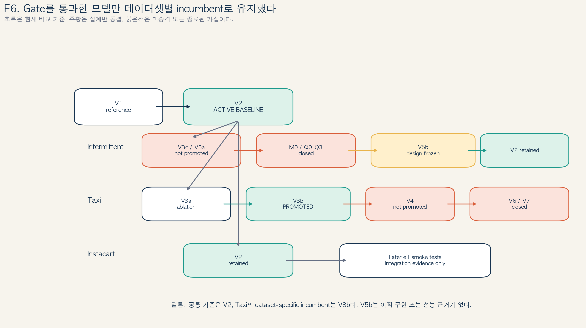

# 2026년 6월 28일 이후 TitanTPP 진행 결과 및 면담 자료

- 보고 기준일: 2026년 7월 19일
- 보고 범위: 2026년 6월 28일 이후 완료한 분석과 모델 강화 실험
- 현재 기준 모델: Demand·Instacart는 TitanTPP V2, Taxi는 TitanTPP V3b
- 주의: RMTPP·TitanTPP·THP의 최종 e800 공정 비교는 모델과 조건만 고정했으며 아직 실행하지 않았다.

## 1. 요약

6월 28일 이후에는 교수님께서 말씀하신 두 가지 가능성을 먼저 확인했다. 첫째,
학습률을 높이면 수렴이 빨라지는지, 둘째, 전체 NLL을 구성 요소로 나누었을 때 특정
손실이 학습을 지배하는지였다. 이후 RMTPP의 확률 모형은 유지하면서 Titan
backbone과 수량 예측 구조를 단계적으로 보강했다.

현재까지 확인된 결론은 다음과 같다.

1. Instacart RMTPP의 seed-42 e50 실험에서는 학습률을
   `1e-3`에서 `5e-3`으로 높였을 때 best validation NLL epoch가 26에서 5로
   빨라졌다. 그러나 `1e-2`에서는 다시 epoch 26이었고, TitanTPP의 일부 설정은
   `5e-3` 또는 `1e-2`에서 NaN이 발생했다. 따라서 학습률 부족은 일부 원인이지만
   학습률만 높여 해결되는 문제는 아니었다.
2. Taxi e1000 분석에서는 RMTPP와 TitanTPP 모두 best epoch 이후 validation NLL이
   악화되는 구간이 확인됐다. 이때 time NLL은 계속 낮아져도 marker NLL이 악화될 수
   있었으므로, 이후에는 total NLL, marker NLL, time NLL을 분리해서 판단했다.
3. TitanTPP V2는 V1보다 세 데이터셋 모두에서 quantity MAE를 낮췄다. 다만
   Instacart와 Taxi에서는 test NLL이 각각 0.04%, 1.23% 악화됐고 두 버전의 선택
   candidate도 달랐다. 따라서 V2는 수량 예측을 개선한 후속 기준선이지 모든
   지표에서 V1을 일관되게 이긴 모델이라고 해석하지 않는다.
4. Taxi V3b는 V2와 candidate, epoch, seed, lookback, max sequence length를 맞춘
   비교에서 세 seed 모두 total NLL, marker NLL, quantity MAE, mark accuracy를
   개선했다. 이 결과에 따라 Taxi만 V3b를 채택하고 Demand와 Instacart는 V2를
   유지한다.
5. 현재 결과는 외생변수를 추가한 모델을 검증한 것이 아니다. 정확한 기여는
   RMTPP의 mark·time 확률 모형을 유지하면서 event representation과 quantity
   prediction objective를 확장한 것으로 한정한다.

## 2. 교수님 의견에 대한 확인 결과

### 2.1 학습률을 5배·10배 높였을 때

F1은 e50, seed 42에서 수행한 학습률 민감도 확인이다. RMTPP의 best validation NLL
epoch는 `1e-3 / 5e-3 / 1e-2`에서 각각 `26 / 5 / 26`이었다. `5e-3`은 실제로
수렴을 앞당겼지만 `1e-2`까지 올렸을 때 같은 효과가 유지되지는 않았다.

TitanTPP는 backbone candidate와 quantity loss 설정에 따라 결과가 달랐다. 일부
조합은 높은 학습률에서도 완료됐지만, 일부는 epoch 4, 10, 28 등에서 NaN이
발생했다. 이 결과는 “낮은 학습률이 장기 학습의 일부 원인”이라는 가설은
지지하지만, “5배 또는 10배로 올리면 안정적으로 해결된다”는 결론은 지지하지
않는다. 이후 기준 학습률은 안정성이 확인된 `1e-3`으로 유지했다.

### 2.2 e1000에서 손실을 분리해서 본 결과

Taxi e1000에서 선택된 RMTPP h128과 TitanTPP mid-LMM 설정의 best validation NLL
epoch는 각각 861과 987이었다. 마지막 epoch의 validation NLL은 best epoch보다
RMTPP에서 0.0873, TitanTPP에서 0.0406 높았다. 즉 두 모델 모두 장기 학습에서
과적합 가능한 용량은 있었다.

중요한 점은 total NLL만 보면 이 변화를 충분히 설명할 수 없다는 것이다. 예를 들어
best epoch 이후 marker NLL이 악화되는 동안 time NLL은 더 낮아질 수 있다. 따라서
이후 모든 모델 선택에서는 다음을 함께 확인했다.

- `total NLL = marker NLL + time NLL`을 구성 요소별로 확인한다.
- quantity MAE, mark accuracy, time error를 함께 본다.
- best validation NLL checkpoint와 마지막 epoch 결과를 구분한다.

F1과 F2는 교수님 의견에 답하기 위한 진단 실험이다. 모두 seed-42 기반이므로 최종
모델 우위를 주장하는 근거로 사용하지 않는다.

## 3. RMTPP에서 TitanTPP V2·V3b로의 변경

RMTPP와 TitanTPP 계열에서 유지한 부분과 변경한 부분은 다음과 같다.

| 모델 | 유지한 부분 | 변경한 부분 | 역할 |
|---|---|---|---|
| RMTPP | 다음 mark의 categorical likelihood와 다음 시간의 conditional density | recurrent history encoder | 원래 확률 모형 기준선 |
| TitanTPP V1 | RMTPP의 mark·time head | history encoder를 Titan 계열로 교체하고 mark-bin 내부 residual을 예측 | 초기 Titan 기준선 |
| TitanTPP V2 | V1의 backbone과 RMTPP head | residual loss와 실제 quantity expectation loss를 함께 사용 | Demand·Instacart 기준, Taxi 비교 기준 |
| TitanTPP V3b | V2의 backbone과 RMTPP head | mark별 residual head를 두고 quantity loss에서 mark probability 경로만 detach | Taxi 채택 모델 |

V2의 quantity expectation은 가능한 mark별 수량과 예측 mark 확률을 결합한다.
V3b는 mark마다 별도 residual을 예측하되, quantity loss가 mark classifier를 직접
흔들지 않도록 해당 확률 경로를 차단한다. marker NLL은 여전히 mark head를 정상적으로
학습하므로 분류 학습 자체를 멈춘 구조는 아니다.

이 설계는 RMTPP의 출력 분포를 폐기한 새 point-process model이 아니라,
동일한 next-event likelihood 위에서 history representation과 quantity objective를
확장한 구조다.

## 4. 완료한 모델 비교

### 4.1 V1 대비 V2

V1과 V2는 e200, seeds 42·52·62로 수행했고 각 데이터셋에서 mean best validation
NLL이 가장 낮은 candidate를 선택한 뒤 test split을 평가했다.

| 데이터셋 | V1 → V2 candidate | score 변화 | test NLL 변화 | quantity MAE 변화 |
|---|---|---:|---:|---:|
| Instacart | mid_lmm → small_lmm | +0.000377 | +0.040% | -1.041% |
| Demand | small_lmm → small_lmm | +0.007727 | -0.316% | -9.943% |
| Taxi | small_lmm → mid_lmm | +0.016058 | +1.233% | -25.858% |

세 데이터셋에서 quantity MAE는 모두 낮아졌다. 그러나 Instacart와 Taxi의 test NLL은
소폭 악화됐고, 두 데이터셋은 V1과 V2의 선택 candidate가 다르다. 그러므로 이 표는
동일 candidate에서 objective 하나만 바꾼 순수 ablation이 아니라 각 버전의
selection rule을 적용한 후속 모델 비교다. V2는 quantity-aware 기준선으로 채택하되
“V1보다 모든 면에서 우수하다”고 표현하지 않는다.

### 4.2 Taxi V2 대비 V3b

Taxi 비교에서는 V2와 V3b 모두 `mid_lmm`, e50, seeds 42·52·62, lookback 168,
max_seq_len 256, batch size 128을 사용했다. checkpoint도 동일하게 best validation
NLL로 선택했다.

| 지표 | V3b의 V2 대비 변화 |
|---|---:|
| total NLL | -2.335% |
| marker NLL | -16.448% |
| time NLL | +0.181% |
| quantity MAE | -49.086% |
| value MAE | -27.303% |
| mark accuracy | +0.729%p |

total NLL, marker NLL, quantity MAE, mark accuracy의 개선 방향은 세 seed에서 모두
같았다. 반면 time NLL은 평균 0.181% 악화됐다. 따라서 V3b의 이득은 time model의
개선이 아니라 mark와 quantity의 결합 방식을 바꾼 데서 나온 것으로 해석한다.
이 결과는 Taxi에만 적용하며 Demand와 Instacart로 일반화하지 않는다.

## 5. 모델 강화 결과의 현재 상태

V2 이후의 실험은 새 구조를 계속 누적하기보다 동일한 통과 기준으로 기존 모델을
넘는지 확인하는 방식으로 진행했다.

| 범위 | 현재 모델 | 판단 |
|---|---|---|
| Demand | V2 small_lmm | V3c, V5a, M0, Q0-Q3가 V2를 일관되게 넘지 못해 유지 |
| Instacart | V2 small_lmm | e1 검증은 구현 확인용으로만 사용하고 V2 유지 |
| Taxi | V3b mid_lmm | 동일 조건의 3-seed 비교를 통과해 V2 대신 채택 |
| V5b | 미채택 | class-balanced CE 계약만 설계했으며 실행 결과는 없음 |
| V6·V7 | 종료 | 추가 history summary의 사전 검증이 통과 기준을 충족하지 못함 |

Magnitude/RevIN 및 Q 계열은 큰 quantity error를 줄이는 경우가 있었지만, 표본이
많은 작은 수량 구간과 mark prediction을 함께 손상시켰다. 이 결과를 “RevIN이
일반적으로 효과가 없다”고 해석하지 않고, 현재 sparse event setup과 해당
normalization 설계가 기존 V2보다 낫지 않았다고만 기록한다.

## 6. RMTPP·TitanTPP·THP 최종 비교 조건

최종 비교에서는 “Titan backbone의 효과”와 “quantity input/objective의 효과”를
구분하기 위해 원래 RMTPP와 quantity-matched RMTPP를 모두 둔다.

| 비교군 | 목적 |
|---|---|
| RMTPP-R0 | 기존 RMTPP 구성 자체와 비교 |
| RMTPP-matched | TitanTPP와 같은 quantity input·objective를 주고 encoder 차이를 비교 |
| THP-matched | Transformer 계열 history encoder와 비교 |
| TitanTPP | Demand·Instacart V2, Taxi V3b를 평가 |

공통 실행 조건은 epochs 800, seeds 42·52·62, learning rate `1e-3`, batch size
128, 고정 train/validation/test split이다. selection은 validation의
`best_val_nll`만 사용하며 test 결과를 보고 candidate나 epoch를 다시 고르지 않는다.

| 데이터셋 | RMTPP | THP | TitanTPP | lookback | max_seq_len |
|---|---|---|---|---:|---:|
| Demand | GRU h64 | d_model 64 | V2 small_lmm | 52 | 16 |
| Instacart | GRU h64 | d_model 64 | V2 small_lmm | 52 | 16 |
| Taxi | GRU h128 | d_model 128 | V3b mid_lmm; V2도 내부 기준으로 병기 | 168 | 256 |

이 절의 모델과 조건은 고정했지만 e800 실행은 아직 하지 않았다. 따라서 최종
RMTPP·TitanTPP·THP 우위에 관한 문장은 해당 실험이 끝난 뒤에만 작성한다.

## 7. 현재 제안하는 연구 기여와 면담 안건

현재 증거와 가장 직접적으로 대응하는 설명은 다음과 같다.

> RMTPP의 next-mark 및 next-time likelihood는 유지하면서 Titan 계열 history
> representation과 quantity-aware prediction objective를 결합하고, mark와 quantity
> 간 gradient interference를 완화하는 구조를 검증했다.

이 설명에서는 V2를 세 데이터셋 공통의 quantity-aware 기준으로 사용하고,
V3b를 Taxi에서 검증된 task-specific 개선으로 제시한다. 현재 입력은 관측된
event history의 mark, inter-event time, quantity이며 날씨, 프로모션, 외부 충격과
같은 별도 exogenous covariate는 포함하지 않는다.

면담에서는 다음 두 가지를 결정받고자 한다.

1. 현재 범위에서 RMTPP의 representation·quantity objective 개선을 중심으로 논문을
   마무리할지 확인한다.
2. “외생변수에 의한 튀는 수요 반영”을 핵심 기여로 삼는다면, 별도 exogenous feature
   branch와 새로운 대조 실험까지 연구 범위를 확장할지 결정한다.

## 8. 해석 시 유지할 제한

- F1과 F2는 seed-42 진단이므로 최종 모델 비교 결과가 아니다.
- F4의 Instacart와 Taxi는 V1/V2 candidate가 달라 순수 one-factor ablation이 아니다.
- F5의 V3b 결과는 Taxi의 세 seed에서만 확정했다.
- V5b는 설계만 완료했고 성능 실험은 하지 않았다.
- RMTPP·TitanTPP·THP 최종 e800 비교는 실행 전이다.
- observed event history를 exogenous covariate라고 부르지 않는다.
- total NLL 개선만으로 marker와 quantity까지 개선됐다고 말하지 않는다.

## 9. 관련 기록

### 1. Summarize of Core &

- [1. Summarize of Core &](https://app.notion.com/p/2e4bbe4056138158a039ec8a9d3c7db8): RMTPP와 point process의 기초 학습이 정리된 상위 단계
- [Summarize RMTPP](https://app.notion.com/p/2e4bbe40561381c5a442d6e1dace7e18): RMTPP의 mark 확률과 time intensity를 설명할 때 참고

### 2. Confirm and Refine Topic

- [2. Confirm and Refine Topic](https://app.notion.com/p/2e4bbe40561380c19f09f2a0799efc6e): 연구 대상과 구현 범위를 좁힌 단계
- [RMTPP 구현 정리](https://app.notion.com/p/2f9bbe40561380c289a8c47827bc1efc): 현재 TitanTPP에서도 유지하는 RMTPP head와 NLL의 기준
- [Data preparation and split](https://app.notion.com/p/2e4bbe4056138097a53fc95468c8887e): 사건 sequence와 데이터 분할을 설명할 때 참고
- [Hyperparameter and RMTPP comparison](https://app.notion.com/p/358bbe40561380c2a20ac7b602e1012d): 과적합, 모델 크기, RMTPP/TitanTPP 비교 문제의 출발점

### 3. Identify Similar Papers and Contribution

- [3. Identify Similar Papers and Contribution](https://app.notion.com/p/2e4bbe40561380a3bbccfbeeae08902e): contribution을 정리한 상위 단계
- [교수님 피드백 기반 Contribution 정리](https://app.notion.com/p/390bbe405613817abf93e494caf963e1): TitanTPP 자체보다 RMTPP 구조 개선으로 표현해야 한다는 논문 방향의 직접 근거

### 4. Data, protocol and validation

- [4. Data, Protocol, Validation](https://app.notion.com/p/2e8bbe4056138004bc28d9ce611e9e16): 데이터와 비교 규칙의 상위 단계
- [NLL 분해](https://app.notion.com/p/37abbe40561381f7be8ff0a911a182e9): total NLL을 marker/time으로 분리한 이유
- [Taxi e1000 overfit](https://app.notion.com/p/37abbe4056138179975bfd003bace1f3): 모델 용량과 best epoch 이후 악화를 설명하는 근거
- [Instacart TitanTPP learning-rate test](https://app.notion.com/p/391bbe40561381ce8689fd447c8d9a36): 높은 학습률에서 TitanTPP의 불안정성을 설명하는 근거
- [Demand and Taxi learning-rate test](https://app.notion.com/p/393bbe405613819d8fdee93027304b62): 완료 여부와 성능 악화를 구분하는 근거
- [Instacart RMTPP learning-rate test](https://app.notion.com/p/394bbe4056138118bff8d3f20826cd4d): `5e-3`에서 RMTPP 수렴이 빨라진 비교 근거

### 5. Model Design Enhancement

- [5. Model Design Enhancement](https://app.notion.com/p/2e8bbe40561380a88b5eef94e834892e): 2026년 7월의 모델 강화와 gate 결과 전체
- [TitanTPP model status](https://app.notion.com/p/394bbe4056138046bf3bfbc6f4c8c31a): V2 유지, Taxi V3b 승격, 나머지 후보 중단 상태
- [V1/V2 e200](https://app.notion.com/p/394bbe405613819bae3ed954fa08b2dc): V2를 공통 기준으로 정한 세 데이터셋·세 seed 근거
- [V3 design](https://app.notion.com/p/399bbe40561381c3bd56e686555d4492): mark별 value 예측과 V3b gradient 차단의 설계 근거
- [Taxi V2/V3b e50](https://app.notion.com/p/39abbe405613816aad2be79e6f7f0702): 같은 조건에서 확인한 Taxi V3b의 최종 비교 근거
- [Q0/Q1/Q2 result](https://app.notion.com/p/39cbbe405613812b8a44eba91ea82e92): 큰 수량 오차 감소와 `1-9`·marker 손상 trade-off의 대표 근거
- [V6 result](https://app.notion.com/p/3a0bbe4056138182bae2c5241cb4cea8): lookback 이전 이력을 추가하지 않기로 한 근거
- [V7 result](https://app.notion.com/p/3a2bbe40561381caa49ce6022be5992d): time-only 과거 이력 확장을 중단한 근거
- [V5b design](https://app.notion.com/p/3a2bbe40561381c3b087c53a945c0a63): 아직 실행 전인 class imbalance 후속안

## 10. 파일과 실험 근거

- 실행 규칙: `TEST_SESSION_PROTOCOL.md`
- 모델 강화 해석: `search_artifacts` 및 `TITANTPP_MODEL_STATUS.md`
- 학습률: `inter_yt_lr_sensitivity_e50`, `insta_lr_sensitivity_e50`, `insta_rmtpp_lr_sensitivity_e50`
- e1000 분해: `search_artifacts/nll_decomposition_yellow_overfit_e1000`
- V1: `search_artifacts/model_enhancement_v1_residual_e200_0705`
- V2: `search_artifacts/model_enhancement_v2_hybrid_e200_0705`
- Taxi V2: `search_artifacts/model_enhancement_v2_taxi_multiseed_e50_0710`
- Taxi V3b: `search_artifacts/model_enhancement_v3b_taxi_multiseed_e50_0710`

모든 최종 수치는 발표 자료를 만들 때 manifest, summary, test summary, histories,
scale-wise 결과 순서로 다시 대조한다. 원천 레코드 수와 전처리 후 사건 수는 같은
수치처럼 제시하지 않는다.
