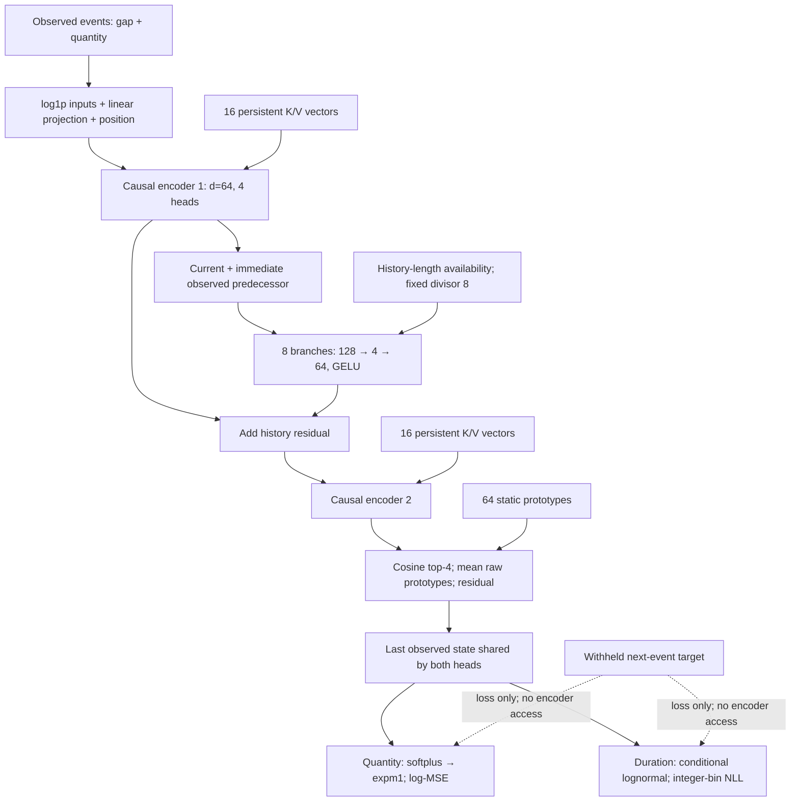

작성일: 2026-09-30 · 선택 구조: `titantpp_history_mlp` · 기존 validation 결과만 사용

**1–3단계 완료.** 방법 수식·기호 정의·그림·코드 대응·설계 근거·기존 MAC 비용 감사를 작성했다. 방법 관련8개 파일이 동결 source SHA와 일치하며, 작은 CPU 수식 검증의 최대 오차는 5.204170427930421e-18이었다. 새 GPU 작업·학습·replay·스케줄러는 시작하지 않았다.

기존 설계안: <mention-page url="https://app.notion.com/p/3ebbbe40561381059aa0c5b73d6d47e3"/>

# TitanTPP: method draft

**Draft status:** implementation-aligned methods text, 30 September 2026. The paper name *TitanTPP* denotes the selected `titantpp_history_mlp` configuration. Historical experiment IDs remain unchanged. Equations below describe that configuration, without either of the subsequently tested gates. This draft does not assert an unmeasured speedup over Titans-MAC.

## 1. Prediction task and observed inputs

Let an event history be $`\mathcal H_n=\{(t_i,q_i)\}_{i=1}^{n}`$, where $`t_i`$ is the recorded event time, $`\Delta_i=t_i-t_{i-1}`$ is the supplied inter-event duration, and $`q_i\geq0`$ is the event quantity. We predict the duration and quantity of the next event from the observed history. Quantity is a numerical regression target; it need not be an event-type label. The present experiments evaluate next-event prediction and do not establish a method for arbitrary-horizon forecasts on a regular time grid.

For a padded sequence, let $`v_i`$ indicate a valid row and $`w_i`$ indicate an observed row permitted as encoder input. Define $`o_i=v_iw_i`$. The two input features and their embedding are

$$
f_i=[\log(1+\Delta_i),\log(1+q_i)]^\top,\qquad
x_i=o_i\left(W_{\mathrm{in}}f_i+b_{\mathrm{in}}+p_i\right). \tag{1}
$$

Here $`p_i`$ is a learned positional embedding and the hidden dimension is $`d=64`$. In implementation, unobserved inputs are replaced by zero **before** the logarithm and projection. Thus even invalid values at withheld or padded positions cannot enter the representation. Each training window contains an observed prefix and one target row. The target row is withheld from the encoder, and the heads read the last observed state. Its duration and quantity are used only to evaluate the loss.

## 2. Causal encoding with persistent vectors

TitanTPP contains two pre-normalized causal attention blocks. For block $`\ell`$, each attention head projects the normalized event states into queries, keys and values. A learned persistent bank $`P^{(\ell)}\in\mathbb R^{16\times d}`$ is split across the heads and prepended to their keys and values:

$$
K=[P^{(\ell)};K_{\mathrm{events}}],\quad
V=[P^{(\ell)};V_{\mathrm{events}}],\quad
A_i=\operatorname{softmax}\!\left(Q_iK^\top/\sqrt{d_h}+C_i\right)V. \tag{2}
$$

There are four heads and $`d_h=16`$. The additive mask $`C_i`$ permits every persistent vector and only observed event keys at positions $`j\leq i`$. The bank supplies the same raw vectors as keys and values; it is not passed through the event key/value projections. Attention dropout and a learned output projection precede the attention residual. A second residual contains a pre-normalized feed-forward network of width 128 with GELU and dropout. Dropout is 0.1; unobserved query states are zeroed after each residual. Denote the resulting block by $`\mathcal E_\ell`$. The first block produces $`H^{(1)}=\mathcal E_1(X)`$.

These persistent vectors are ordinary model parameters learned by the outer training optimizer. They remain fixed during inference. They do not implement an online neural-memory update.

## 3. A bottleneck correction from adjacent observed states

The correction between the two encoder blocks combines the current state with its immediate observed predecessor. Let $`\pi(i)`$ be the preceding observed position, skipping padding, and let $`c_i`$ count observed rows since the most recent withheld valid row, including position $`i`$. For thresholds $`\tau=(1,2,4,8,16,32,64,128)`$, define a deterministic availability mask

$$
a_{i,b}=o_i\,\mathbf 1\{c_i>\tau_b\},\qquad b=1,\ldots,8. \tag{3}
$$

Each branch contains bias-free matrices $`U_b\in\mathbb R^{4\times2d}`$ and $`V_b\in\mathbb R^{d\times4}`$. The correction and its insertion are

$$
r_i=\frac{1}{8}\sum_{b=1}^{8}a_{i,b}V_b\operatorname{GELU}\!\left(U_b[h_i^{(1)};h_{\pi(i)}^{(1)}]\right),
\qquad \widetilde h_i^{(1)}=h_i^{(1)}+r_i,
\qquad H^{(2)}=\mathcal E_2(\widetilde H^{(1)}). \tag{4}
$$

GELU follows the exact error-function formulation. Although the thresholds differ, all eight branches read the **same immediate predecessor**. The thresholds control availability, not retrieval lag. The divisor is always eight, including when only some branches are active. When no branch is available, the correction is exactly zero. A withheld valid row resets correction eligibility, whereas padding does not. This eligibility rule does not reset the causal attention history of the encoder.

The module adds $`8(2dr+rd)=6{,}144`$ parameters for $`r=4`$. We initialize every $`V_b`$ to zero. Consequently the correction is zero at initialization; shared encoder and head parameters therefore retain the predictions of the configuration without this correction under the same stochastic state. Module construction preserves the caller's random-number stream. This establishes a common initialization, not evidence that zero initialization itself improves final accuracy. The implementation computes the current and predecessor projections before gathering their low-dimensional values; it is algebraically equivalent to (4).

The bottleneck provides a limited-capacity path for adjusting intermediate event representations. The predecessor state is already causally contextualized, so the complete model is not restricted to two raw events. Conversely, the correction is not an online learned memory and is not a bank of eight different temporal lags.

## 4. Static prototype retrieval and shared prediction state

A separate bank $`M\in\mathbb R^{64\times d}`$ provides static retrieval after the second block. For each observed query, select four prototypes by cosine similarity, then add their unweighted mean:

$$
S_i=\operatorname{TopK}_{j,\,k=4}\operatorname{cos}(h_i^{(2)},m_j),\qquad
z_i=o_i\left(h_i^{(2)}+\frac14\sum_{j\in S_i}m_j\right). \tag{5}
$$

Normalization is used for selection only. The vectors added to the residual are the raw prototypes, not their normalized versions or a softmax-weighted average. Keys and values are tied. This bank is distinct from the persistent vectors inside attention. Both banks are learned during training and receive no online writes during inference. The last observed state $`z_n`$ is shared by the time and quantity heads.

## 5. Numerical quantity and recorded-duration heads

The quantity head predicts on the log-transformed scale:

$$
\widehat y_{n+1}=\operatorname{softplus}(w_q^\top z_n+b_q),\qquad
\widehat q_{n+1}=\exp(\widehat y_{n+1})-1. \tag{6}
$$

This is a nonnegative point prediction, not a fitted probability density over quantity. At initialization, $`w_q=0`$ and the bias gives $`\widehat y=\overline{\log(1+q)}_{\mathrm{train}}`$. This differs from initialization at the arithmetic mean of raw quantities.

The time head parameterizes a positive latent duration $`T`$:

$$
\mu_n=w_\mu^\top z_n+b_\mu,\quad
\sigma_n=\operatorname{softplus}(w_\sigma^\top z_n+b_\sigma)+10^{-3},\quad
\log(T/s)\mid\mathcal H_n\sim\mathcal N(\mu_n,\sigma_n^2). \tag{7}
$$

Recorded durations follow a positive-integer observation model, $`D=\max(1,\operatorname{round}(T))`$, with an additional upper code $`K=30`$ for Instacart. Writing $`F_n`$ for the CDF of $`T`$, the observed probability mass is

$$
p(D=d\mid\mathcal H_n)=
\begin{cases}
F_n(1.5),&d=1,\\
1-F_n(K-0.5),&d=K\text{ when upper coding applies},\\
F_n(d+0.5)-F_n(d-0.5),&\text{otherwise}.
\end{cases} \tag{8}
$$

The first bin begins at zero, rather than 0.5. The scale $`s`$ is 1 hour for Taxi, 3 weeks for Intermittent, and 7 days for Instacart. The implementation evaluates log masses in float64 using stable CDF or survival-function differences. Reported time NLL is the negative log of (8), not the continuous lognormal density at the recorded integer.

## 6. Optimization and checkpoint selection

For a minibatch $`\mathcal B`$ of history–target pairs, the training objective is

$$
\mathcal L=\frac1{|\mathcal B|}\sum_{n\in\mathcal B}
\left[-\log p(D_{n+1}\mid\mathcal H_n)
+\big(\widehat y_{n+1}-\log(1+q_{n+1})\big)^2\right]. \tag{9}
$$

The quantity term carries weight one, and the objective contains no additional tail loss. Each window contributes one final target. We optimize with AdamW with learning rate $`10^{-3}`$, weight decay 0.01, gradient clipping at norm 1, and batch size 128. Training permits at most 300 epochs and stops no earlier than epoch 40, with early-stopping patience of 40. The selected checkpoint is the earliest checkpoint attaining the strictly lowest finite validation RMSE on the raw quantity scale. MAE and time NLL are reported at that same checkpoint; their minima are not selected separately. Seeds are 42, 52 and 62.

The representative architecture was selected after examining validation results. These results support model development; they are not an untouched test estimate. An independently authorized final evaluation remains separate from this methods draft.

## 7. Relationship to Titans and scope of the efficiency claim

Titans introduces neural long-term memory that learns at test time. TitanTPP instead uses fixed learned banks and a feed-forward history correction, with no online associative optimization or surprise-momentum state during inference. This distinguishes the inference computation, but does not imply that all memory has been removed. The relevant experimental comparator is the repository's **Titans-MAC event adapter**, whose adaptation and implementation must be disclosed, rather than an asserted reproduction of every original Titans experiment. [Titans, original paper](https://arxiv.org/abs/2501.00663).

The correction requires linear dense projection work in sequence length for fixed width and branch count. The encoder still performs full causal attention; removing online memory updates does not make the whole backbone linear in sequence length. Existing timings do not establish a matched speedup, lower peak GPU memory, or equal-accuracy efficiency advantage over the MAC adapter. Those claims require the measurements specified in the accompanying efficiency audit.

## Notation and fixed dimensions

<table header-row="true">
<tr><td>Symbol</td><td>Meaning</td><td>Fixed value or scope</td></tr>
<tr><td>$`\Delta_i,q_i`$</td><td>Recorded gap and numerical event quantity</td><td>Observed history only</td></tr>
<tr><td>$`v_i,w_i,o_i`$</td><td>Valid, permitted observation and effective observation masks</td><td>Boolean</td></tr>
<tr><td>$`p_i`$</td><td>Learned position embedding</td><td>Maximum sequence includes the target</td></tr>
<tr><td>$`d,H,d_h,d_{ff}`$</td><td>Hidden width, heads, head width, feed-forward width</td><td>64, 4, 16, 128</td></tr>
<tr><td>$`P^{(\ell)}`$</td><td>Persistent key/value bank in block $`\ell`$</td><td>16 × 64 per block</td></tr>
<tr><td>$`\pi(i),c_i`$</td><td>Immediate observed predecessor; local observed count</td><td>Padding skipped; withheld eligibility reset</td></tr>
<tr><td>$`a_{i,b}`$</td><td>Deterministic branch-availability mask</td><td>Not a learned Gate</td></tr>
<tr><td>$`U_b,V_b,r`$</td><td>Input/output matrices and bottleneck width</td><td>4 × 128; 64 × 4; 4</td></tr>
<tr><td>$`M,S_i`$</td><td>Final static prototype bank and selected indices</td><td>64 × 64; top four</td></tr>
<tr><td>$`z_n`$</td><td>Last observed shared head input</td><td>64-dimensional</td></tr>
<tr><td>$`s,K`$</td><td>Duration scale and optional upper code</td><td>Dataset-specific; K=30 only for Instacart</td></tr>
</table>

## Figure caption

**Figure 1.** TitanTPP encodes observed gaps and quantities with two causal attention blocks. An eight-branch bottleneck residual combines current and immediately preceding contextual states between the blocks. Branch availability depends on observed history length; all branches use lag one. A static top-four prototype residual supplies the shared state for duration likelihood and quantity regression. Persistent and retrieval banks are learned offline and fixed at inference. The target row is excluded from the encoder. Rendered figure: `architecture.svg` (architecture.svg); `architecture.mmd` (editable Mermaid source).

Implementation trace and source hashes: `code_equation_map.md` (code_equation_map.md), `verification.json` (verification.json). Fixed contract: `eff125f587f7a9a8097d5d43b3d688eac481abb78bb6006b5aa4ab1b0ec2a88d`.

---

# 구조 그림

SVG·PNG·PDF 원본은 로컬 `reports/titantpp_method_efficiency_20260930_v1/`에 저장했다. Notion에는 편집 가능한 동일 구조의 Mermaid를 넣었다.

---

# 수식과 동결 구현의 대응 — 확인 완료

현재 파일이 원본 core 계약의 해당 8개 source SHA와 일치함을 먼저 검사했다. 단순히 최신 코드의 동작을 과거 결과에 소급하지 않았다. 전체 97개 manifest closure를 대조했으며, 이번에는 아래 방법 관련 8개 파일의 실제 bytes를 검증했다. 5090 전체 원격 binary/source 회수 감사와는 별개다.

<table header-row="true">
<tr><td>수식·설명</td><td>실제 구현</td><td>확인한 경계</td></tr>
<tr><td>(1) 입력·관측 마스크</td><td>`models/TPPs/CountAwareTitanMultiLagDetail.py`, `_encode_base`</td><td>dt/q 모두 observed 위치만 사용, log1p, projection+position</td></tr>
<tr><td>마지막 관측에서 다음 사건 예측</td><td>`paper/scripts/count_aware_tpp_backbone/core.py`, `target_outputs`</td><td>`target_positions=lengths-1`, `history_positions=lengths-2`, target write 금지</td></tr>
<tr><td>(2) 두 causal block</td><td>`models/Titan/backbone.py`, `TitanBackbone.forward`; `models/Titan/common/memory.py`, `MemoryAttention.forward`</td><td>pre-LN·causal/observed mask·persistent K/V·dropout·두 residual</td></tr>
<tr><td>(3) predecessor·가용성</td><td>`models/TPPs/CountAwareTitanMultiLagDetail.py`, `lag_source_indices(mode='local')`</td><td>8개 모두 직전 관측, padding skip, withheld valid row에서 eligibility reset</td></tr>
<tr><td>(4) MLP 잔차</td><td>`models/TPPs/CountAwareTitanCoreAblation.py`, `HistoryCorrection.__init__/forward`</td><td>8×(128→4→64), bias 없음, exact GELU, 고정 /8, output zero, RNG 보존</td></tr>
<tr><td>(4) 삽입 위치</td><td>`models/TPPs/CountAwareTitanMultiLagDetail.py`, `_encode_base`</td><td>첫 block 출력에 잔차 추가한 뒤 두 번째 block</td></tr>
<tr><td>(5) 정적 검색</td><td>`models/Titan/common/memory.py`, `HardLocalMemoryMatcher.forward`</td><td>cosine top4, raw prototype 산술평균, tied K/V, residual</td></tr>
<tr><td>(5) 동일 head state</td><td>`models/TPPs/CountAwareTitanMultiLagDetail.py`, `encode_task_states`</td><td>time/quantity에 동일 검색 후 state 반환</td></tr>
<tr><td>(6) 수량 head</td><td>`models/TPPs/CountAwareTPP.py`, `predict_quantity`, `quantity_outputs`, head 초기화</td><td>softplus log prediction, expm1, log-MSE, 수량 분포 모델 아님</td></tr>
<tr><td>(7) 시간 head</td><td>`models/TPPs/CountAwareTPP.py`, duration parameter 계산 및 time likelihood 경로</td><td>heteroscedastic lognormal, sigma floor .001</td></tr>
<tr><td>(8) 관측 시간 질량</td><td>`models/TPPs/positive_integer_time.py`, `positive_integer_log_mass`</td><td>첫 bin (0,1.5), 중간 폭1, Instacart top-code30</td></tr>
<tr><td>(9) loss/selector</td><td>`paper/scripts/count_aware_tpp_backbone/core.py`, `target_outputs`; `training.py`, `train_one`</td><td>시간 NLL+log 수량 MSE; 선택은 별도 raw validation RMSE</td></tr>
</table>

원본 파일 경로의 기준은 저장소 루트 `/Users/igwanhyeong/PycharmProjects/paper_research`다. 정확한 byte 해시는 `verification.json` (verification.json)에 있다.

## CPU 수식 검증

`audit.py` (audit.py)는 동결 SHA가 일치하는 `HistoryCorrection`을 CPU에서만 호출해 논문 수식과 구현을 비교한다. 작은 합성 텐서에 대해 출력 행렬을 영 초기값과 비영 값으로 각각 설정한다. optimizer·학습·checkpoint replay는 실행하지 않는다.

- 6,144개 파라미터, 영 초기 잔차, 호출자 RNG 보존 확인.
- 명시적으로 현재/직전 표현을 concat하는 수식과 project-before-gather 구현의 일치 확인.
- padding을 건너뛰는 predecessor, withheld 뒤 가용성 reset, 여덟 branch 동일 predecessor 및 고정 8 나눗셈 확인.
- 숨겨진 위치의 NaN이 결과에 들어오지 않는지와 미래 hidden 변경이 과거 correction에 영향을 주지 않는지 확인.
- 이 검사는 correction 수식의 동치 검증이다. 전체 모델 GPU 재검증이나 인과성 새 실험으로 확대 해석하지 않는다.

---

# 설계 이유와 증거 — 정리 완료

## 논문에서 제안하는 방법

> **TitanTPP는 사건 간격과 수량을 인과적으로 인코딩하고, encoder 사이의 저차원 인접 이력 잔차와 학습된 정적 검색을 결합하여 다음 사건 수량을 예측한다. 추론 중 신경 메모리의 온라인 갱신 없이 관측 이력을 활용한다.**

이 문장이 방법의 출발점이다. 최종 구성은 `titantpp_history_mlp` 하나이며, Full과 Gate는 구성 비교 및 별도 탐색 결과다. 단순한 연속값 출력의 최초 제안, 온라인 메모리의 보편적 불필요성, 입증되지 않은 MAC 대비 가속을 C1에 포함하지 않는다. 기존 Titans 전체에서 모든 Memory를 제거했다는 설명도 실제 구현과 맞지 않는다.

## 설계 목적·확인 사실·미확인 효과를 구분한다

<table header-row="true">
<tr><td>설계와 목적</td><td>확인된 근거</td><td>논문에서 주장할 범위 / 남는 질문</td></tr>
<tr><td>시간·수량 log1p 입력: 불규칙한 간격과 사건 크기를 함께 표현</td><td>동결 코드 식(1); 외부 TPP도 같은 관측 정보·head/loss로 비교</td><td>공통 문제 설정이다. 이 입력만의 독창성이나 두 feature 각각의 인과적 기여는 별도 입력 제거 실험 없이 주장하지 않는다.</td></tr>
<tr><td>causal encoder: 관측 이력을 인코딩하고 다음 사건 정보를 차단</td><td>target row mask와 직전 관측 state 선택; causal key mask</td><td>미래 target이 encoder에 들어가지 않는 구현이다. B도 이력을 인코딩하므로 B를 ‘이력 없는 모델’로 부르지 않는다.</td></tr>
<tr><td>encoder 사이 인접 이력 보완: 현재/직전 contextual state의 결합을 다음 block에 전달</td><td>식(3–4); 동일 프로토콜 B↔MLP 결과</td><td>모듈 추가 구성의 이득을 평가한다. 용량도 6,144개 증가하므로 모든 이득을 ‘인접 관계’ 하나에 인과적으로 귀속하지 않는다.</td></tr>
<tr><td>폭4·8분기 residual: 보완 용량 제한</td><td>6,144개 parameter와 고정 /8 수식·CPU 동치 검사</td><td>구조적 용량 제한은 사실이다. 최적 rank·최적 분기 수 또는 Full 대비 parameter 절약은 입증되지 않았다. Full도 6,144개다.</td></tr>
<tr><td>영 출력 초기화: 공통 초기 함수를 보존</td><td>잔차0·RNG 보존, 기존 초기화 감사와 이번 CPU 검사</td><td>초기 예측 보존의 수학적 성질은 설명한다. 일반화·학습 안정성 개선의 독립 효과는 주장하지 않는다.</td></tr>
<tr><td>persistent bank와 정적 top4 retrieval: 학습된 참조 표현을 공급</td><td>식(2),(5); 16개/64개 bank, 추론 중 쓰기 없음</td><td>‘메모리 전체 제거’가 아니라 ‘온라인 신경 메모리 갱신 생략’이다. Full 기반 no-static 결과로 MLP의 검색 필요성을 직접 입증하지 않는다.</td></tr>
<tr><td>온라인 associative update 생략: 갱신·momentum 상태 없이 실행</td><td>MLP forward 경로; Titans 원문과 MAC 구현 경로</td><td>연산 절차 차이는 확인됐다. 현재 MLP↔MAC 실제 속도·peak 메모리 우위는 별도 측정 대상이다.</td></tr>
<tr><td>수량 회귀+시간 likelihood: 다음 사건의 크기·간격을 함께 학습</td><td>식(6–9); 공통 head/loss의 외부 비교</td><td>continuous-valued point regression이며 수량의 연속 확률분포를 새로 정의한 것은 아니다. 시간 성능 동시 개선도 주장하지 않는다.</td></tr>
</table>

## 이력 보완의 현재 실험 근거

같은 validation RMSE-selected checkpoint의 **3seed 평균**을 비교했다. 감소율은 `100 × (1 − MLP/B)`다. 표준편차와 개별 seed는 `../titantpp_first_analysis_20260930_v1/report.md` (기존 1차 분석)을 함께 제시한다. 아래 감소율은 평균 간 대비이며 통계적 유의성 검정이 아니다.

<table header-row="true">
<tr><td>데이터</td><td>B → MLP MAE</td><td>B → MLP RMSE</td><td>MAE / RMSE 감소</td><td>시간 NLL B → MLP</td></tr>
<tr><td>Taxi</td><td>28.7545 → 25.6237</td><td>90.5093 → 79.7111</td><td>10.89% / 11.93%</td><td>0.72468 → 1.03867</td></tr>
<tr><td>Intermittent</td><td>0.75876 → 0.70052</td><td>1.78056 → 1.67303</td><td>7.68% / 6.04%</td><td>0.38462 → 0.49711</td></tr>
<tr><td>Instacart</td><td>3.99317 → 3.99157</td><td>5.87957 → 5.88274</td><td>0.04% / −0.05%</td><td>2.80647 → 2.80709</td></tr>
</table>

따라서 이력 보완의 가장 직접적인 결과는 **Taxi·Intermittent 수량 개선, Instacart 이득 제한, 시간 지표와의 상충관계**다. MLP는 Taxi에서 Full보다 평균 RMSE가 1.19% 높고, Intermittent에서는 7.77% 낮다. 대표 모델을 데이터별로 바꿔 선택하지 않는다.

외부 RMTPP·THP·NHP·SAHP 비교는 공통 head 아래의 encoder 경쟁력 근거다. 이 표가 원본 각 모델의 native head와 최적 튜닝까지 포함한 보편적 순위를 의미하지는 않는다. 기존 validation 분석 후 MLP를 채택했으며, 독립 평가 여부는 별도로 공개한다.

## Writing notes / claim–evidence map

사용자가 지정한 산출물: **“방법 절 초안·기호 정의표·구조 그림·코드와 수식의 대응표”**. 문서 분량이나 논문 전체 페이지 제한은 주어지지 않았다. 본 초안은 영어 Method 본문과 한국어 검토 자료로 구성했으며, 학회 제출용 최종 축약본은 아니다.

<table header-row="true">
<tr><td>Method 문단</td><td>핵심 주장</td><td>출처 / 확실성</td></tr>
<tr><td>1</td><td>observed gap/quantity, target exclusion, next-event scope</td><td>core contract + `target_outputs`; 구현 사실</td></tr>
<tr><td>2</td><td>causal blocks와 persistent K/V</td><td>동결 backbone/memory 소스; 구현 사실</td></tr>
<tr><td>3</td><td>lag-one bottleneck 수식·마스킹·영 초기화</td><td>동결 HistoryCorrection + CPU 식 동치; 수학/구현 사실</td></tr>
<tr><td>4</td><td>static cosine top4 raw mean, shared head state</td><td>동결 HardLocalMemoryMatcher; 구현 사실</td></tr>
<tr><td>5–6</td><td>수량 point regression·관측 정수 시간 질량·손실과 선택의 분리</td><td>frozen head/likelihood/trainer/contract; 구현 사실</td></tr>
<tr><td>7</td><td>온라인 갱신 없는 구성과 Titans의 차이</td><td>[Titans 원문](https://arxiv.org/abs/2501.00663), 로컬 MAC adapter; 메커니즘 비교</td></tr>
<tr><td>설계 목적</td><td>보완 표현·제한된 용량</td><td>의도와 실험 결과를 구분한 설명; 구성 요소별 독립 인과 주장 아님</td></tr>
<tr><td>효율</td><td>현재 MAC 대비 직접 속도비 미확정</td><td>`efficiency_audit.md` (비용 감사); 증거 한계 명시</td></tr>
</table>

영문 문장은 정의·계산·실험 해석의 확실성을 구분했다. `encode`, `combine`, `predict`, `retain`, `evaluate`처럼 실제 동작을 드러내는 동사를 중심으로 썼고, 수식 전후의 짧은 정의와 긴 조건 설명을 섞었다. 설계 의도를 성능 보장으로 표현하는 문장, ‘memory-free’, ‘first continuous-mark paradigm’, ‘6.86× faster TitanTPP’는 제외했다. 문단은 문제→입력→encoder→보완→검색→head→선택→주장 한계 순서다. 새로운 선행연구 전체 조사는 수행하지 않았으므로 독창성의 최종 문헌 검토는 남아 있다.

---

# Titans-MAC 대비 효율 근거 — 기존 기록 감사 완료

대상: `paper_research` 로컬 validation 기록과 당시 source revision. 2026-09-30 작성. 이번 작업은 원격 접속·GPU 측정·학습·checkpoint replay를 수행하지 않았다.

**결론: 기존 MAC 기록은 온라인 갱신을 포함한 adapter의 비용이 컸다는 과거 근거로 재사용할 수 있다. 현재 채택한 TitanTPP가 MAC보다 몇 배 빠른지는 아직 직접 입증되지 않았다.** 학습 속도에 초/epoch를 쓰는 것은 타당하지만, 동일한 처리량과 timer 범위를 맞춰야 한다.

## 1. 기존 MAC 자료로 사용할 수 있는 값

<table header-row="true">
<tr><td>데이터</td><td>과거 B0 초/완료 epoch</td><td>과거 MAC 초/완료 epoch</td><td>MAC/B0</td><td>B0/MAC 완료 epoch</td></tr>
<tr><td>Taxi</td><td>7.6847</td><td>52.7067</td><td>6.8587배</td><td>42 / 46</td></tr>
<tr><td>Intermittent</td><td>107.0674</td><td>583.2923</td><td>5.4479배</td><td>240 / 229</td></tr>
</table>

이 수치는 당시 `summary.elapsed_seconds / completed_epochs`다. 과거 trainer revision `08e59880cd61cbd27cec40aa04636452b87bebfc`의 timer를 확인했다. epoch loop 직전에 시작해 매 epoch의 train·validation·기록·저장을 거치고, loop 이후 best-state validation 및 checkpoint 저장 뒤에 끝난다. 따라서 **완료 epoch당 상각된 실행 시간**이며, 순수 train-only 시간이나 warm-up 제외 epoch 중앙값이 아니다. 초기 모델·loader 준비는 timer 시작 전이다. elapsed에 포함되지 않은 외부 작업까지 합산한 전체 캠페인 시간도 아니다.

원본: `paper/results/count_aware_titantpp_mac_b1_audit_20260830_recovery1/historical_cost.csv`. 이번 재계산: `historical_costs.csv` (historical_costs.csv). 역사적 RAF 기록은 현재 세 데이터의 비용표에서 제외했다.

별도의 짧은 profiler 기록은 다음과 같다.

<table header-row="true">
<tr><td>데이터</td><td>B0 target_outputs 중앙값</td><td>MAC target_outputs 중앙값</td><td>B0 peak allocated</td><td>MAC peak allocated</td></tr>
<tr><td>Taxi</td><td>5.284 ms</td><td>35.019 ms</td><td>364.889 MiB</td><td>74.295 MiB</td></tr>
<tr><td>Intermittent</td><td>5.276 ms</td><td>33.737 ms</td><td>364.889 MiB</td><td>145.053 MiB</td></tr>
</table>

**이 표는 ‘순수 backbone inference’라고 이름 붙이지 않는다.** profiler source revision `cc0382a21f3d1e37e41692bb8dd673fc01582c59`와 원본 manifest SHA가 일치한다. `benchmark_validation_forward`는 batch를 loader에서 받은 후 GPU 동기화·timer를 시작하고, device 전송과 `target_outputs`의 encoder·head·target loss 계산을 포함해 측정한다. loader 대기는 제외된다. 다섯 batch 중 첫 회를 cold, 나머지 네 회를 steady로 요약한 짧은 표본이다. `estimated_compile_overhead`는 cold−steady 차이일 뿐 compile만 분리한 실측이 아니다. 모델은 no-grad 평가를 하지만 MAC 내부의 관측 메모리 갱신은 그 forward 경로의 일부다.

MAC의 peak allocated가 더 낮았던 반례를 보존한다. 서로 다른 profiler/학습 peak를 섞지 않으며, 이 기록으로 현재 TitanTPP의 메모리 절약을 주장하지 않는다. allocated·reserved·parameter 수는 서로 다른 양이다.

## 2. 현재 TitanTPP 자체의 기록

<table header-row="true">
<tr><td>데이터</td><td>GPU / 단독 비교 가능 seed</td><td>실행 초/완료 epoch, 평균 ± 표본 SD</td><td>학습 peak allocated</td><td>Parameter</td></tr>
<tr><td>Taxi</td><td>5080 / 42·52·62</td><td>13.015 ± 0.011</td><td>1,869.468 MiB</td><td>96,003</td></tr>
<tr><td>Intermittent</td><td>5080 / 42·52·62</td><td>123.096 ± 1.186</td><td>1,869.468 MiB</td><td>96,003</td></tr>
<tr><td>Instacart</td><td>5090 / 42만</td><td>245.149, n=1</td><td>410.045 MiB</td><td>83,715</td></tr>
</table>

학습 peak는 원래 summary 기록이며 위의 과거 no-grad profiler peak와 직접 비교하지 않는다. 첫 두 행은 seed별 `fit_elapsed/completed_epochs` 세 값의 평균 ± **seed 간** 표본 SD다. 개별 epoch 시간의 변동이나 confidence interval이 아니다. Instacart는 positional embedding 길이가 64여서 parameter 수가 다르다(Taxi/Intermittent256). 동일한 구성 규칙을 사용한다.

현재 timer도 `train_one`의 epoch loop부터 종료 후 내부 selected validation·저장까지 포함한다. 캠페인의 별도 selected/last endpoint replay, 사전 qualification, 배포 시간을 이 수치에 더하지 않았다. 원래 기록 시간을 추정 보정하지 않았다.

Instacart seed52는 병렬 실행, seed62는 병렬·재부팅 복구 조건이다. 둘 다 원래 기록과 함께 `current_mlp_costs.csv` (current_mlp_costs.csv)에 남겼지만 단독 속도 평균에서 제외했다. 특히 seed62 `elapsed_seconds`는 복구 후 구간이므로 전체 75epoch로 나누어 속도로 제시하지 않았다.

## 3. 직접 비교에 남는 불일치

<table header-row="true">
<tr><td>항목</td><td>확인 사실</td><td>현재 MLP↔MAC 주장에 미치는 영향</td></tr>
<tr><td>비교 모델</td><td>과거 비용의 상대 모델은 B0, 현재 대표는 History MLP</td><td>과거 5.45/6.86배를 현 TitanTPP 가속 배수로 옮길 수 없음</td></tr>
<tr><td>시간 head·loss</td><td>과거 legacy clamped head, 현재 heteroscedastic lognormal + 정수 관측 질량</td><td>연산량·gradient·학습 동작이 다름</td></tr>
<tr><td>선택/조기 종료</td><td>과거 joint objective, 현재 raw quantity RMSE</td><td>전체 학습 시간 및 상각 평균의 구성과 정확도 비교에 영향</td></tr>
<tr><td>실행 장치</td><td>과거 Taxi shard 계약은 RTX5090-server, 현재 Taxi는 5080</td><td>같은 물리 GPU 비교가 아님. 과거 계약 host 표기는 UUID/부하 실측의 대체물도 아님</td></tr>
<tr><td>과거 Intermittent 장치 증거</td><td>recovery5080 역할 기록이 있으나 일부 상위 계약 host는 MacBook, 요약에 UUID/runtime 없음</td><td>배정 기록과 실제 물리 장치·단독 점유 보장을 구분</td></tr>
<tr><td>데이터/입력 부하</td><td>안정화 MAC52/62는 같은 data/split SHA·target 수·batch·max sequence 설정</td><td>주요 workload 설정은 재사용 가능하나 실제 측정 batch 순서·길이·padding까지 맞췄다는 증거는 아님</td></tr>
<tr><td>MAC 내부 정책</td><td>과거42 unbounded, 안정화52/62 inner clip1</td><td>하나의 동일 3seed 설정으로 합칠 수 없음</td></tr>
<tr><td>비교 목적</td><td>과거 elapsed, 짧은 target_outputs, 현재 train peak가 혼재</td><td>각 timer와 작업을 별도 표로 보고해야 함</td></tr>
</table>

데이터 계약 호환성 근거: `../titans_mac_reuse_audit_20260928_v1/mac_current_compatibility.csv` (기존 6조건 감사). 이 문서의 과거 학습 진행 상태 서술은 당시 이력이며, 현재 모든 승인 학습이 종료된 사실과 별개다.

## 4. 연산 경로의 비교로 지금 말할 수 있는 것

<table header-row="true">
<tr><td>경로</td><td>Titans-MAC 이벤트 adapter</td><td>채택 TitanTPP</td></tr>
<tr><td>시간·수량 이벤트 입력</td><td>이벤트 wrapper로 적응</td><td>같은 문제의 log1p 입력</td></tr>
<tr><td>이력 표현</td><td>attention과 neural memory의 retrieval/update 경로</td><td>두 causal encoder 사이 bottleneck residual</td></tr>
<tr><td>온라인 상태</td><td>관측에 대한 associative gradient, update/forget/momentum 및 neural-memory parameter 상태</td><td>forward-local hidden/gather, 온라인 parameter 갱신 없음</td></tr>
<tr><td>고정 학습 bank</td><td>MAC 구성의 persistent memory</td><td>encoder persistent16 및 static prototype64 유지</td></tr>
<tr><td>구현 해석</td><td>원 논문의 메커니즘을 사건 입력에 적용한 로컬 adapter</td><td>원본 Titans의 모든 구성·벤치마크를 그대로 축소했다는 주장 아님</td></tr>
</table>

‘온라인 갱신 계산 경로를 생략했다’는 구현으로 확인한 사실이다. ‘실행 시간이 감소한다’는 장치·구현별 실측 주장이고, ‘같은 정확도에서 비용이 감소한다’는 별도의 학습 결과 주장이다. 세 주장을 혼동하지 않는다. 병목이 달라질 수 있고 full causal attention은 여전히 길이에 대해 이차 비용을 포함한다.

## 5. 부족한 측정의 최소 범위와 승인 판단

**권장: 먼저 짧은 동일 부하 profile만 보완한다 — 승인 필요, 미실행**

- 목적: 현재 TitanTPP와 MAC adapter의 **step 비용·평가 경로 지연·메모리**를 같은 장치에서 직접 비교한다. 장기 수렴이나 정확도 우열은 측정 목표가 아니다.
- 대상: 개인 5080 한 장 단독, 현 Native Runtime 유지. 모델은 채택 MLP와 inner-clip1을 명시한 MAC adapter 두 개, 데이터는 Taxi·Intermittent의 **train만**. common input/head/loss/batch128/정밀도/입력 mask를 맞춘다. 기존 결과 checkpoint를 덮어쓰지 않는 별도 scratch 경로를 사용한다.
- 고정 표본: 각 train loader에서 동일 seed42 순서의 32 batch와 준비용 5 batch. target ID와 실제 길이·padding histogram을 저장한다. 모델별 같은 순서·같은 입력을 주고 MAC의 sample-local memory reset/write 규칙은 보존한다. MAC update를 끈 비교로 대체하지 않는다.
- 반복: 데이터×모델 각각 3회. 각 반복은 같은 초기 state에서 준비용5+측정32 optimizer step을 실행한다. 총 최대444 step으로 **성능 학습에 합치지 않고 폐기**한다. 평가 모드 forward+head 경로는 동일32 batch×3회, 별도 initial state에서 측정한다. batch128 지연이며 단일 요청 지연이라고 부르지 않는다.
- 측정: host→device 포함/제외 경계를 분리하고 synchronized wall time·처리 targets/s·각 반복 중앙값/사분위수·allocated/reserved peak·parameter 수를 기록한다. loader 대기·checkpoint 저장은 별도이며, cold/compile 시간을 따로 남긴다. 각 모델·반복을 별도 process로 실행해 allocator peak를 분리한다.
- 한도 제안: 준비 포함 **총 GPU 점유 30분**, 동시 worker 없음, 실패 자동 retry 없음. finite 값·mask·source/head 정합성 검증 실패 시 본 측정 차단. 이 한도에서 끝나지 않으면 미완료를 보고하고 자동 연장하지 않는다. 추가 임대비0, 전력은 미측정이다.
- 승인 전 준비할 계약: 정확한 MAC wrapper/source SHA, 두 모델 공통 head·loss, batch manifest, 프로파일러 timer, GPU UUID·Runtime·단독 점유 확인 방법과 중단 guard를 고정한다. 위는 검토 가능한 측정 범위이며 **실행 permit은 아니다**.

이 최소 profile 결과를 **실측 초/epoch로 환산해 표시하지 않는다**. `측정32 batch × 전체 step수`는 추정치에 불과하다.

**논문에 실제 초/epoch가 꼭 필요할 경우 — 별도 후속 승인 판단**

- profile로 측정 가능성을 확인한 뒤, 두 데이터×두 모델에서 **전체 train 1회 cold + 2회 반복**(최대12 epoch)을 별도 scratch에서 계측한다. 이는 최소 전량 반복이며 정밀한 분산 추정은 아니다.
- 전체 target 수/step 수는 Taxi38,393/300, Intermittent393,824/3,077로 동일하게 고정한다. train-only와 train+validation을 섞지 않는다. 반복 epoch마다 실제 처리량과 시간 기록을 남긴다.
- 실제 승인 요청 전 profile 실측으로 최대 점유시간을 산정한다. 현재 과거 MAC 시간으로 새 실행 예산을 확정하거나 30분 한도에 전량12epoch가 들어간다고 약속하지 않는다.

**동일 정확도까지의 효율 또는 MAC보다 높은 정확도 — 이번 범위 밖**

짧은 profile이나 세 epoch로는 검증할 수 없다. 현재 head·선택 규칙의 별도 MAC 장기 비교가 필요하며 기존 9조건 미승인 계획을 자동 실행하지 않는다. 반대로 방법 설명과 기존 TPP 대비 수량 결과를 쓰는 데 장기 MAC9조건을 선행 필수로 둘 이유도 없다.

## 검증·재현

`/usr/local/bin/python3 reports/titantpp_method_efficiency_20260930_v1/audit.py`

새 source나 기존 scientific 결과를 변경하지 않는다. 비용 재계산·8개 방법 source SHA·manifest closure·작은 CPU 수식 동치를 검사한다. 검증 결과 `verification.json` (verification.json), 기계 판독 판단 `efficiency_audit.json` (efficiency_audit.json), 읽은 파일 `sources.json` (sources.json). 5090 최종 binary/source 회수 감사는 이 작업에서 완료한 것으로 표시하지 않는다.

# 현재 상태와 다음 작업

**방법·근거·기존 비용 감사 — 완료**
- 로컬 재현 산출물: `reports/titantpp_method_efficiency_20260930_v1/README.md`, `audit.py`, `verification.json`, `sources.json`.

**짧은 효율 측정 — 다음 작업 / GPU 실행 승인 필요**
- 5080 단독, 두 모델×두 데이터, 총30분 상한 profile 범위를 먼저 검토한다. 전체 epoch와 정확도 장기학습은 별도다.

**5090 최종 binary/source 감사·독립 평가 — 이후 작업**
- 현재 방법 문서 검증이 이 잔여 작업의 완료를 뜻하지 않는다. 스케줄러는 재생성하지 않는다.
